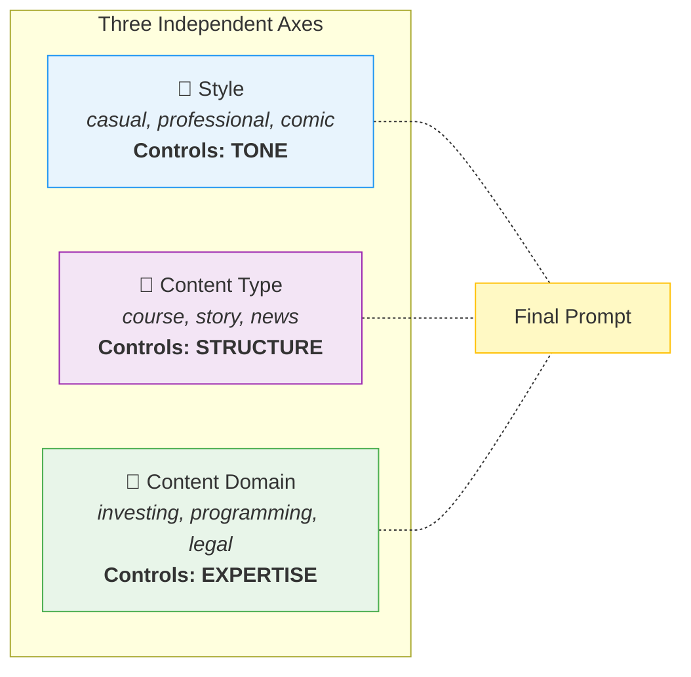
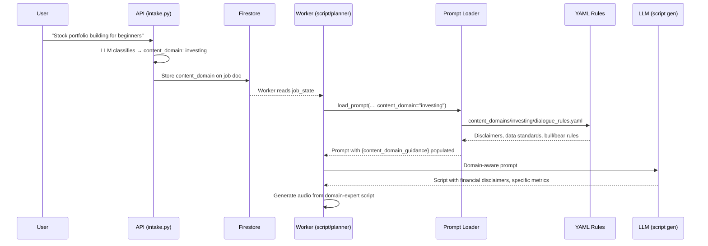
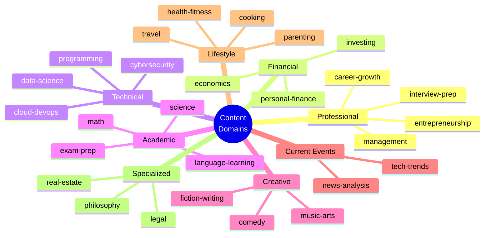
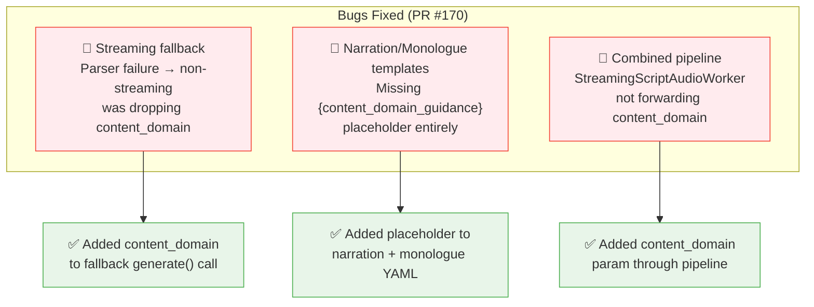

# Content Domain Classification System

A third axis of prompt composition that injects **domain-expert knowledge** into every piece of content KitesForU generates. Shipped March 14–15, 2026.

> [!TLDR]
> **Before:** "Stock market investing" and "Python programming" got identical generic prompt rules.
> **After:** Investing content gets financial disclaimers, data standards, and bull/bear balance requirements. Programming content gets code-in-audio techniques, progressive depth rules, and anti-pattern guidance. 27 domains total, zero code changes to add more.

---

## The Three-Axis Model

Content quality was one-dimensional — every topic got the same rules. We already had Style (tone) and Content Type (structure). We added a third independent axis: **Content Domain** (expertise).



These three axes compose cleanly and never conflict. A `course` (type) about `investing` (domain) in `casual` (style) works perfectly — each axis contributes its own layer to the prompt.

| Axis | Prompt Variable | Controls | Set By |
|------|----------------|----------|--------|
| Style | `{style_guidance}` | Tone — how it sounds | User choice |
| Content Type | `{content_type_guidance}` | Structure — progression, arcs | Regex detection in workers |
| **Content Domain** | `{content_domain_guidance}` | Expertise — what it knows | LLM classification at intake |

---

## How It Works



### Key Files (click to view on GitHub)

#### API (kitesforu-api)

| File | Purpose |
|------|---------|
| [intake.py](https://github.com/vikrantb/kitesforu-api/blob/main/src/api/services/smart_create/intake.py) | LLM tool schema with 28-value `content_domain` enum + system prompt guidance |
| [chat/prompts.py](https://github.com/vikrantb/kitesforu-api/blob/main/src/api/services/smart_create/chat/prompts.py) | Chat mode tool schema (mirrors intake) |
| [executor.py](https://github.com/vikrantb/kitesforu-api/blob/main/src/api/services/smart_create/executor.py) | Persists `content_domain` to Firestore for all 5 content types |
| [session.py](https://github.com/vikrantb/kitesforu-api/blob/main/src/api/services/smart_create/session.py) | Stores `high_quality` flag in session for refine continuity |

#### Workers (kitesforu-workers)

| File | Purpose |
|------|---------|
| [content_domain.py](https://github.com/vikrantb/kitesforu-workers/blob/main/src/workers/prompts/content_domain.py) | Domain registry — filesystem discovery, path traversal protection |
| [loader.py](https://github.com/vikrantb/kitesforu-workers/blob/main/src/workers/prompts/loader.py) | Loads domain rules into `{content_domain_guidance}` variable |
| [planner/worker.py](https://github.com/vikrantb/kitesforu-workers/blob/main/src/workers/stages/planner/worker.py) | Reads `content_domain` from job_state → passes to prompt builder |
| [script/worker.py](https://github.com/vikrantb/kitesforu-workers/blob/main/src/workers/stages/script/worker.py) | Reads `content_domain` from job_state → passes to all prompt paths |
| [streaming_generator.py](https://github.com/vikrantb/kitesforu-workers/blob/main/src/workers/stages/script/streaming_generator.py) | Streaming path + all 4 fallback paths forward `content_domain` |
| [streaming_script_audio_worker.py](https://github.com/vikrantb/kitesforu-workers/blob/main/src/workers/stages/combined/streaming_script_audio_worker.py) | Combined pipeline path |

#### Prompt Templates

| File | Placeholder Added |
|------|-------------------|
| [outline_generation.yaml](https://github.com/vikrantb/kitesforu-workers/blob/main/src/workers/prompts/stages/planner/outline_generation.yaml) | `{content_domain_guidance}` in outline section |
| [dialogue_generation.yaml](https://github.com/vikrantb/kitesforu-workers/blob/main/src/workers/prompts/stages/script/dialogue_generation.yaml) | `{content_domain_guidance}` in dialogue section |
| [narration_generation.yaml](https://github.com/vikrantb/kitesforu-workers/blob/main/src/workers/prompts/stages/script/narration_generation.yaml) | `{content_domain_guidance}` for narration format |
| [monologue_generation.yaml](https://github.com/vikrantb/kitesforu-workers/blob/main/src/workers/prompts/stages/script/monologue_generation.yaml) | `{content_domain_guidance}` for monologue format |

#### Domain YAML Files

[Browse all 27 domains on GitHub →](https://github.com/vikrantb/kitesforu-workers/tree/main/src/workers/prompts/content_domains)

[Domain system README →](https://github.com/vikrantb/kitesforu-workers/blob/main/src/workers/prompts/content_domains/README.md)

---

## Domain Taxonomy (27 + general)



Each domain has 3 YAML files:

```
content_domains/{domain-id}/
├── profile.yaml           # Name + description
├── outline_rules.yaml     # How to structure outlines
└── dialogue_rules.yaml    # Expert rules for script generation
```

---

## What the Domain Rules Actually Do (Examples)

> [!IMPORTANT]
> These rules fundamentally change what the LLM generates. They're not cosmetic — they add disclaimers, enforce data standards, and prevent domain-specific mistakes.

### Investing

| Rule Category | Example Rules |
|--------------|---------------|
| **Disclaimers** | "not financial advice" woven naturally into dialogue; "past performance doesn't guarantee future results" when discussing returns |
| **Data standards** | Specific numbers required: "S&P 500 returned 10.7% annually over 30 years" — never "the market generally goes up" |
| **Balance** | Every bullish point must acknowledge a bearish counterpoint |
| **Audio-first** | Never reference charts; verbalize trends; pace numerical data with pauses |
| **Anti-patterns** | No bare ticker symbols without context; no price targets; no percentage changes without base |

### Programming

| Rule Category | Example Rules |
|--------------|---------------|
| **Code-in-audio** | Never read raw code — use pseudocode: "you'd create a function that takes a list and returns the filtered items" |
| **Progressive depth** | Beginner: mental models and intuition. Advanced: internals, edge cases, performance |
| **Pitfall pattern** | "a mistake many developers make is..." → explain WHY → provide correct approach |
| **Audio limits** | Max 3-5 steps per walkthrough; never dictate syntax characters |
| **Anti-patterns** | No language-war framing; no "just Google it"; no raw syntax dictation |

### Legal

| Rule Category | Example Rules |
|--------------|---------------|
| **Strong disclaimer** | "This is legal education, not legal advice" — woven conversationally, not as a footer |
| **Jurisdiction** | "In the US..." with "check your local laws" caveat |
| **Case teaching** | Use landmark cases as examples (Brown v. Board, Miranda) |
| **Myth-busting** | Correct common misconceptions (Miranda rights, assault vs battery) |

<details>
<summary>View all 27 domain rule themes</summary>

| Domain | Key Expertise Rules |
|--------|-------------------|
| investing | Financial disclaimers, specific metrics (P/E, Sharpe), bull+bear balance |
| programming | Code-in-audio technique, progressive depth, pitfall patterns |
| career-growth | Specific scripts over platitudes, scenario-based teaching |
| health-fitness | Medical disclaimers, evidence hierarchy, exercise cues for audio |
| exam-prep | Exam-specific accuracy, mnemonics, question pattern analysis |
| personal-finance | Tax disclaimers, concrete dollar examples, behavioral awareness |
| fiction-writing | Craft vocabulary, before/after rewrites, genre conventions |
| news-analysis | Source attribution, fact/opinion distinction, historical context |
| data-science | Math-in-audio (no formulas), ML pitfall awareness, statistical thinking |
| cybersecurity | Responsible disclosure, attack-defense pairing, real breach case studies |
| cloud-devops | Distributed systems analogies, real outage post-mortems, cost awareness |
| economics | Multi-school fairness (Keynesian/Austrian/MMT), causation discipline |
| tech-trends | Hype vs substance, adoption data, historical pattern comparison |
| interview-prep | Mock interview format, STAR method, salary negotiation scripts |
| entrepreneurship | Real company examples, honest about failure rates, lean startup |
| management | Scenario-driven ("your top performer wants to quit"), framework-based |
| language-learning | Phonetics for audio, realistic timelines, plateau diagnosis |
| science | Experiment storytelling, analogy breakdowns, uncertainty language |
| math | Explain without equations, intuition before rigor, history/discovery |
| comedy | Be funny don't explain funny, timing cues ([beat], [pause]), callbacks |
| music-arts | Describe sound evocatively, intuitive theory (rhythm=heartbeat) |
| parenting | Evidence-based (AAP), age-specific, inclusive family structures |
| travel | Sensory descriptions for audio, cultural sensitivity, budget specifics |
| cooking | Audio technique descriptions, food science, substitution guidance |
| legal | Strong disclaimers, jurisdiction scoping, landmark case teaching |
| real-estate | Specific metrics (cap rate, cash-on-cash), market cycle awareness |
| philosophy | Thought experiments, multi-tradition fairness, steelmanning |

</details>

---

## High-Quality Planning Option

> [!COST]
> **Standard:** ~$0.001/plan (gpt-4o-mini) — unchanged default
> **High quality:** ~$0.01/plan (gpt-4o) — opt-in via `high_quality: true`

When `high_quality: true` is sent in the request body, the intake LLM uses `gpt-4o` instead of `gpt-4o-mini`. This produces better domain classification, more detailed outlines, and higher quality titles.

**Observed difference:**
- gpt-4o-mini classified "quantum computing for business leaders" as `general`
- gpt-4o correctly classified it as `tech-trends`

The flag is persisted in the session, so refine requests and chat follow-up messages automatically use the same model.

**Files:** [intake.py](https://github.com/vikrantb/kitesforu-api/blob/main/src/api/services/smart_create/intake.py) · [chat/service.py](https://github.com/vikrantb/kitesforu-api/blob/main/src/api/services/smart_create/chat/service.py) · [session.py](https://github.com/vikrantb/kitesforu-api/blob/main/src/api/services/smart_create/session.py)

---

## Bugs Found and Fixed

A thorough data flow audit after the initial implementation found 3 gaps where `content_domain` was silently dropped:



---

## Verification Results

### Full E2E Pipeline Test (Plan → Execute → Script → Audio → GCS)

| Step | Input | Result |
|------|-------|--------|
| 1. Intake | "ETFs vs index funds for retirement" | `content_domain: investing`, session created |
| 2. Execute | session_id → create podcast job | Job ID: `fb6fc808-...` |
| 3. Pipeline | Planner → research → script → audio | Completed after ~3 min |
| 4. Audio | Verify GCS file exists | **5.2 MB MP3**, valid ID3 header |
| 5. Firestore | Check job document | `content_domain: investing` confirmed |

### Domain Classification Tests

| Test Input | Expected Domain | Actual Domain | Result |
|------------|----------------|---------------|--------|
| "Stock portfolio building" | investing | investing | ✅ |
| "Python async patterns" | programming | programming | ✅ |
| "Employment law basics" | legal | legal | ✅ |
| "Italian pasta from scratch" | cooking | cooking | ✅ |
| "Ransomware defense 2026" | cybersecurity | tech-trends | ✅ (valid — framed as trend) |
| "Trolley problem and AI" | philosophy | philosophy | ✅ |
| "Something interesting" | general | general | ✅ |

---

## PRs Shipped

| # | Repo | Title | Review |
|---|------|-------|--------|
| [#188](https://github.com/vikrantb/kitesforu-api/pull/188) | api | feat: add content_domain classification to Smart Create intake | Copilot: clean |
| [#168](https://github.com/vikrantb/kitesforu-workers/pull/168) | workers | feat: add content domain loading infrastructure | Copilot: 1 security fix (path traversal) |
| [#169](https://github.com/vikrantb/kitesforu-workers/pull/169) | workers | feat: add Phase 1 domain YAML files (8 domains) | Copilot: clean |
| [#170](https://github.com/vikrantb/kitesforu-workers/pull/170) | workers | fix: streaming fallback + narration/monologue + combined pipeline | Copilot: 1 fix (combined worker) |
| [#171](https://github.com/vikrantb/kitesforu-workers/pull/171) | workers | feat: complete 27 domains + expert review + docs | Copilot: 2 fixes (README paths, hardcoded year) |
| [#189](https://github.com/vikrantb/kitesforu-api/pull/189) | api | feat: add high_quality option for planning model | Copilot: 4 fixes (session persistence, chat continuity) |

---

## How to Add a New Domain

Zero code changes required. Three steps:

**Step 1:** Create the YAML files

```
src/workers/prompts/content_domains/my-new-domain/
├── profile.yaml
├── outline_rules.yaml
└── dialogue_rules.yaml
```

**Step 2:** Add the domain string to the enum in two files:

- [intake.py — PLAN_TOOL enum](https://github.com/vikrantb/kitesforu-api/blob/main/src/api/services/smart_create/intake.py#L61)
- [chat/prompts.py — GENERATE_PLAN_TOOL enum](https://github.com/vikrantb/kitesforu-api/blob/main/src/api/services/smart_create/chat/prompts.py#L41)

**Step 3:** Deploy both repos. The domain is auto-discovered by workers on next deploy.

---

## What's Next (Frontend)

1. **High Quality toggle** — Add a checkbox on the create page that sends `high_quality: true`. Consider gating behind paid tiers (creator+) since it's 10x cost.

2. **Domain display** — Show the detected domain in the plan review step (e.g., "Expertise: Investing 📈"). This builds user trust that the system understands their topic.

3. **Domain-specific A/B testing** — Create the same topic with and without domain rules to measure quality improvement and build the case for the feature.
