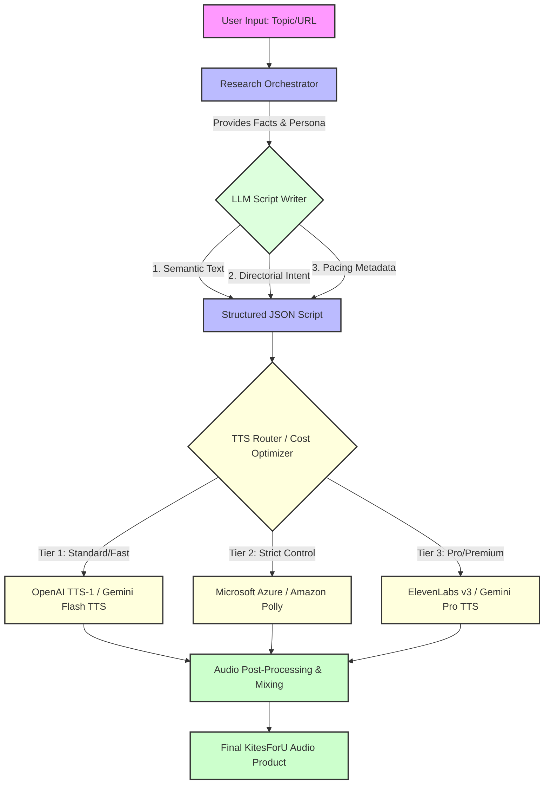
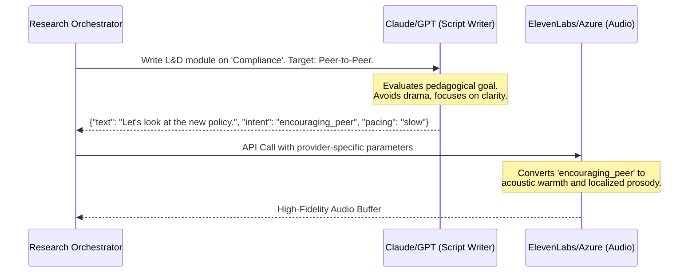
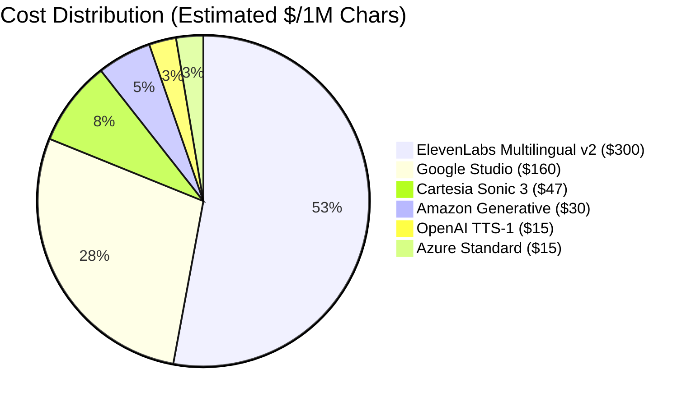

# KitesForU: Synthetic Audio Architecture & Business Master Plan
**Version:** 2.0 (2026 Enhanced)
**Purpose:** Aligning AI Voice Synthesis with B2B/Enterprise Business Objectives

---

## 1. Executive Summary

While consumer tools (like NotebookLM) impress users with generic, highly polished podcast banter, KitesForU’s competitive moat lies in **B2B, Corporate L&D, and Content Marketing**. In these enterprise environments, hyper-dramatic "naturalness" (e.g., crying, extreme hesitation, heavy breathing) is not just unnecessary—it's actively detrimental. 

Instead, our business requires **"High-Trust Acoustic Repair."** This means using AI voices that sound authoritative yet empathetic, capable of pausing for cognitive retention, and localized perfectly for global workforces (e.g., 29+ languages including native Hindi pragmatics).

This document outlines how we will leverage different layers of the AI stack—from the Script-Writing LLM to the final TTS Engine—to create defensible, high-margin audio products.

---

## 2. The KitesForU Audio Generation Pipeline

To achieve premium pricing (e.g., the $199 Pro Creator or Enterprise tiers), we must move away from "flat text-to-speech" and implement a decoupled pipeline. The **Semantic** layer (what is said) must be separated from the **Performance** layer (how it is said).



### Strategic Takeaways from the Pipeline:
1. **Model Agnosticism:** By structuring the script as JSON with "Directorial Intent" rather than hardcoded SSML, we can route the same script to a $15/1M char provider (OpenAI) or a $300/1M char provider (ElevenLabs) without breaking the code.
2. **Margin Protection:** The TTS Router automatically maps the computational cost and security compliance to the user's subscription tier.

---

## 3. The LLM Script Writer Strategy

### What LLMs Support (And What They Don't)
Script-generation LLMs (Claude 4.5, GPT-5-mini, Gemini 2.0) are excellent at understanding context, but they **cannot hear**. 

If you prompt an LLM to "make it natural," it will resort to visual stereotypes of naturalness: `[sighs loudly]`, `um`, `uh`. As noted in our internal research, this granular **Micro-Tagging is a trap** that causes modern TTS engines to overact or glitch.

### The "Directorial Intent" Approach
Instead of generating micro-tags, the LLM's job is to act as a **Director**. 



**LLM Prompting Rules for KitesForU:**
1. **Ban Biological Tags:** Explicitly instruct the LLM *never* to use tags like `[inhales]`, `[clicks tongue]`, or `[swallows]`.
2. **Use Cognitive Stalls:** Teach the LLM to use syntactic naturalness. Instead of `[hesitates]`, write: *"The policy requires... actually, let me rephrase that. It mandates..."*
3. **Native Transcreation:** For non-English languages (e.g., Hindi), the LLM must use native conversational glue (*'acha'*, *'matlab'*) rather than translating English fillers (*'um'*).

---

## 4. TTS Capability Matrix: What Supports What?

To successfully implement the "Directorial Intent" model, we must map our structured JSON script to the specific APIs of each TTS provider. Not all providers interpret "naturalness" the same way.

Here is the exact capability matrix of the 2026 TTS landscape regarding Script Control:

| Provider & Model | Natural Language Prompts | Direct Emotion Tags | SSML Support | Auto-Context Emotion | Best Used For |
|------------------|---------------------------|---------------------|--------------|----------------------|---------------|
| **ElevenLabs v3** | ✅ Parentheticals `(sadly)` | ❌ No | ❌ No | ✅✅ High | High-Fidelity English / Premium L&D |
| **Google Gemini TTS** | ✅✅ Director's Notes | ❌ No | ❌ No | ✅ High | Multilingual Steerable Content (Hindi) |
| **OpenAI gpt-4o-mini-tts** | ✅ System Instructions | ❌ No | ❌ No | ✅ Medium | Conversational & Dynamic Podcasts |
| **Cartesia Sonic 3** | ❌ No | ✅ Explicit `[laugh]` | ❌ No | ✅ Medium | Real-Time Agent Interactions |
| **Inworld TTS 1 Max** | ❌ No | ✅ Experimental | ❌ No | ✅ High | Gaming / Interactive Avatars |
| **Microsoft Azure (DragonHD)**| ❌ No | ✅ Rich Styles | ✅✅ Full | ✅ High | **Enterprise Compliance & Precise Control** |
| **Amazon Polly** | ❌ No | ❌ No | ✅✅ Full | ❌ Low | Legacy integrations |

### Visualization: The Control Spectrum

```mermaid
quadrantChart
    title TTS Provider Control Mechanisms
    x-axis Explicit Control (Tags/SSML) --> Implicit Control (LLM Magic)
    y-axis Low Expressiveness --> High Expressiveness
    quadrant-1 High Expressiveness / Implicit Magic
    quadrant-2 High Expressiveness / Explicit Control
    quadrant-3 Low Expressiveness / Explicit Control
    quadrant-4 Low Expressiveness / Implicit Magic
    "ElevenLabs v3": [0.8, 0.95]
    "Google Gemini TTS": [0.9, 0.85]
    "OpenAI TTS": [0.75, 0.7]
    "Microsoft Azure": [0.3, 0.8]
    "Cartesia Sonic 3": [0.4, 0.75]
    "Amazon Polly": [0.1, 0.4]
    "Inworld": [0.6, 0.85]
```
*(Note: Explicit Control = SSML, Explicit emotion tags. Implicit Control = "Director's Notes", Auto-Context)*

---

## 5. Strategic Evaluation: Should We Add Microsoft Azure TTS?

**The short answer: YES. Microsoft Azure is the ultimate Enterprise Trojan Horse.**

While ElevenLabs wins on raw quality and Gemini wins on prompt-steering, **Microsoft Azure TTS** provides capabilities that are mission-critical for our primary B2B Corporate L&D target market.

### Why Azure is a Strategic Fit for KitesForU:

1. **The Compliance Moat (SOC 2, HIPAA, On-Prem):** Large enterprises (e.g., banking, healthcare) often block APIs that send proprietary data to startups like ElevenLabs or OpenAI due to data privacy fears. Azure offers On-Premises container deployment and enterprise-grade compliance. Having Azure as a TTS option allows KitesForU to pass rigorous enterprise procurement reviews.
2. **Massive Multilingual Scale (150+ Languages):** While Gemini supports 24 languages and ElevenLabs 70+, Azure supports over 150 languages with deep regional variants (e.g., specific dialects of Spanish, Arabic, and Indian languages). This is crucial for global HR training deployments.
3. **Visemes for Future Avatars:** Azure outputs "Speech Marks" (Visemes)—the exact mathematical lip shapes matching the audio in real-time. If KitesForU ever expands from purely audio podcasts to "Talking Head Video Modules" for courses, Azure provides the exact data needed to animate the lips perfectly.
4. **Explicit Control vs. LLM "Magic":** In highly sensitive corporate compliance training, L&D managers don't want the AI to "hallucinate" a sigh, a laugh, or a dramatic pause. Azure's full SSML support allows us to precisely program exactly where pauses happen down to the millisecond, offering absolute deterministic control over the output.

**Implementation Recommendation:** 
Add Azure TTS as the **"Enterprise Compliant" routing option** specifically targeted at high-tier B2B accounts.

---

## 6. TTS Provider Alignment & Business Strategy

Our TTS Research highlighted severe cost and capability differences among providers. We will map these directly to our target ICPs (Ideal Customer Profiles).



### Mapping Tech to Business Value

#### 1. Corporate L&D & Training (High ROI, $5k-$50k/yr)
*   **The Need:** Security, absolute clarity, precise control, localized languages (Hindi, Spanish).
*   **The Tech Stack:** 
    *   **LLM:** Claude 4.5 (best at structured pedagogical writing).
    *   **TTS:** **Microsoft Azure** (for compliance and precise SSML control) or **Google Gemini TTS** (for cost-effective, prompt-steerable Hindi).
*   **Audio Signature:** "The Expert Guide." Minimal hesitations, measured pacing, high clarity.

#### 2. B2B Thought Leadership (Fast PMF, $2k-$10k/yr)
*   **The Need:** Engaging, conversational "podcast" feel to hold attention on LinkedIn or Spotify.
*   **The Tech Stack:**
    *   **LLM:** GPT-4.1 / GPT-5 (excellent at conversational back-and-forth).
    *   **TTS:** **ElevenLabs Expressive Mode** (for premium English/Hindi banter) or **OpenAI gpt-4o-mini-tts** (for fast, steerable chats).
*   **Audio Signature:** "The Peer Conversation." Uses natural interruptions, active listening (`"mm-hmm"`, `"right"`), and faster pacing.

#### 3. Content Agency White-Label (Scale, $10k-$100k/yr)
*   **The Need:** Volume, margin protection, reliability.
*   **The Tech Stack:**
    *   **LLM:** Gemini 2.0 (fast, cost-effective).
    *   **TTS:** **OpenAI TTS-1** or **Amazon Polly Generative**.
*   **Audio Signature:** "The Clean Professional." Standardized, highly reliable, easy to automate at scale.

---

## 7. Implementation Roadmap (How we build this)

To realize this architecture without overwhelming a solo-founder setup, we will implement in three phases:

### Phase 1: The Standardized Payload (Current Focus)
Ensure the `kitesforu-workers` and `kitesforu-api` use a strict Pydantic schema for scripts that separates text from metadata.
```python
class ScriptLine(BaseModel):
    speaker_id: str
    text: str
    emotion_intent: Literal["neutral", "warm", "authoritative", "encouraging"]
    pacing_modifier: float = 1.0 # 1.0 is normal, 1.2 is fast, 0.8 is slow
```

### Phase 2: Provider-Specific Adapters
Build lightweight adapter classes in the Audio Worker that translate our standard `ScriptLine` into the specific requirements of the routed provider:
*   **If ElevenLabs:** Map `emotion_intent` to the `style_exaggeration` parameter.
*   **If Gemini TTS:** Prepend natural language prompts (e.g., *"Say this warmly and encouragingly:"*).
*   **If Azure TTS:** Convert the JSON into precise SSML strings using `<prosody>` and `<mstts:express-as>` tags.
*   **If OpenAI TTS:** Bake the intent into the system instruction for `gpt-4o-mini-tts`.

### Phase 3: The "Context Enhancer" Loop
Re-activate the Claude `ContextEnhancerService` (from the Jan 2026 Plan Review) to dynamically analyze the *target audience* (e.g., "Senior Engineers" vs. "New Hires") and automatically adjust the `emotion_intent` and `pacing_modifier` before the script is even written.

---

## 8. Conclusion: The Defensible Moat

NotebookLM is a "black box"—users put a document in, and a generic (albeit good) podcast comes out. 

**KitesForU's moat is Control, Context, and Compliance.** By implementing this decoupled architecture, we allow Enterprise and B2B users to strictly control the pedagogical tone, the cultural localization (via native Hindi/Spanish transcreation), and the acoustic pacing. Furthermore, by integrating providers like **Microsoft Azure**, we unlock the massive enterprise sector that requires absolute data security and deterministic output. 

We don't just generate audio; we generate *targeted, secure business communication*.