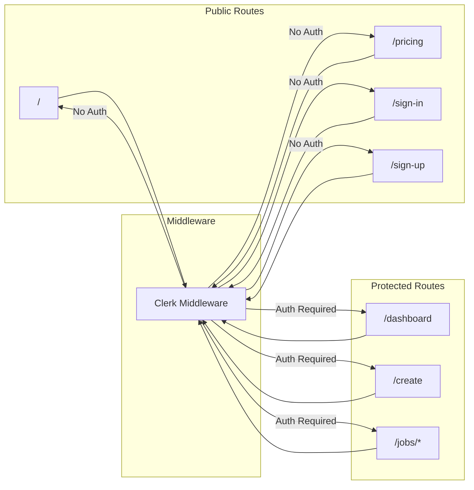

# Authentication Flow Diagram

> **FOR HUMAN CONSUMPTION ONLY** - AI agents should skip this folder

## Overview

KitesForU uses Clerk for authentication with JWT tokens verified by the API.

## Sign-In Flow


## JWT Verification


## Protected Routes



## Token Lifecycle


## Components

### Frontend (Next.js)

```
- ClerkProvider: Wraps app in _app.tsx
- SignIn/SignUp: Clerk-hosted or embedded components
- UserButton: User menu with sign-out
- middleware.ts: Route protection
```

### API (FastAPI)

```
- Auth middleware validates JWT on every request
- Extracts user_id from 'sub' claim
- Caches JWKS for performance
- Returns 401 if token invalid/expired
```

## Configuration

### Frontend Environment

```env
NEXT_PUBLIC_CLERK_PUBLISHABLE_KEY=pk_test_...
CLERK_SECRET_KEY=sk_test_...
```

### API Environment

```env
CLERK_JWKS_URL=https://[clerk-domain]/.well-known/jwks.json
```

## Error Handling

| Error | Cause | Resolution |
|-------|-------|------------|
| 401 Unauthorized | Missing/invalid token | Re-authenticate |
| Token Expired | JWT past expiry | Clerk auto-refreshes |
| Invalid Signature | JWKS mismatch | Check Clerk config |
