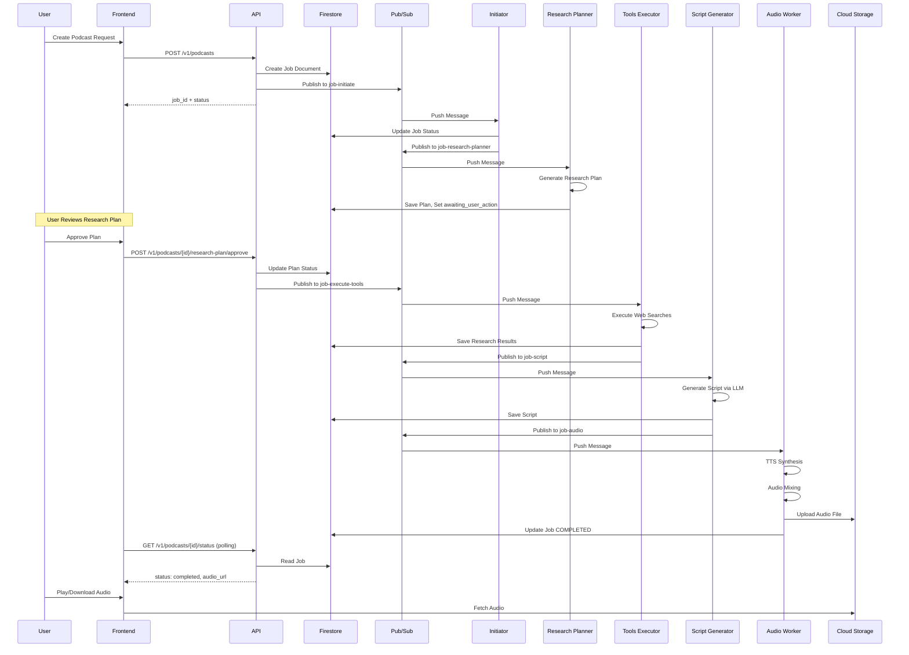

# Data Flow Diagram

> **FOR HUMAN CONSUMPTION ONLY** - AI agents should skip this folder

## Request-to-Response Flow

Complete data flow from user request to podcast delivery.

## Stage Details

### 1. Job Creation
- Frontend submits topic, duration, style
- API validates input
- Job created in Firestore with status=QUEUED
- Message published to job-initiate topic

### 2. Initialization
- Initiator receives message
- May generate clarifier questions
- If clarifying, waits for user answers

### 3. Research Planning
- Research Planner generates 3-4 tasks
- Creates user-facing summary
- Estimates credits and duration
- Waits for user approval

### 4. Research Execution
- Tools Executor runs approved tasks
- Web searches via Tavily API
- URL content extraction
- Aggregates findings

### 5. Script Generation
- Script Generator uses LLM
- Creates host/guest dialogue
- Matches requested style
- Targets specified duration

### 6. Audio Production
- Audio Worker synthesizes speech
- Different voices for speakers
- Mixes segments
- Uploads to Cloud Storage

### 7. Completion
- Job marked COMPLETED
- Audio URL saved
- User can play/download
