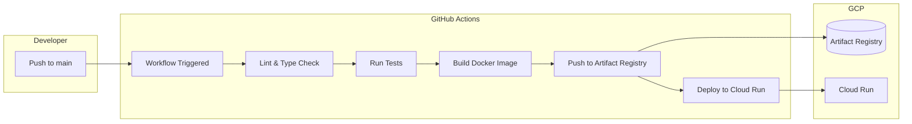
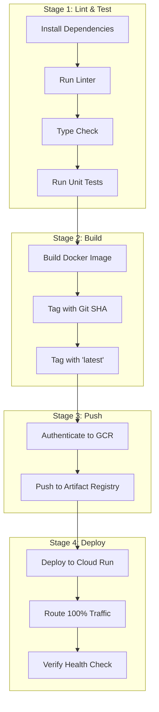
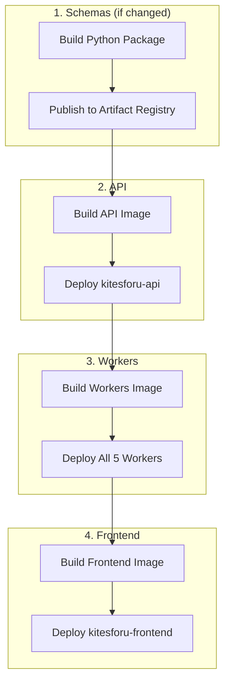
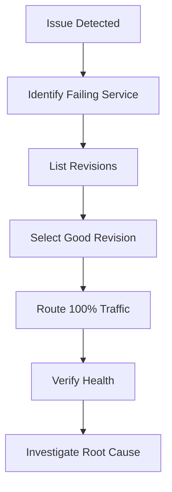
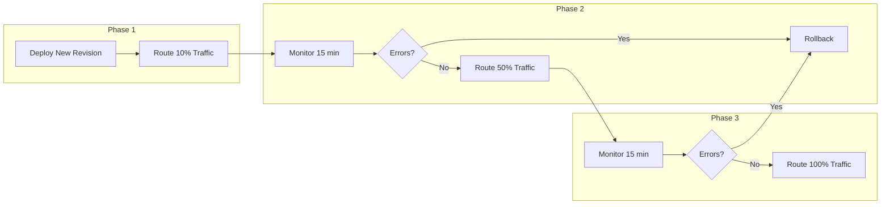
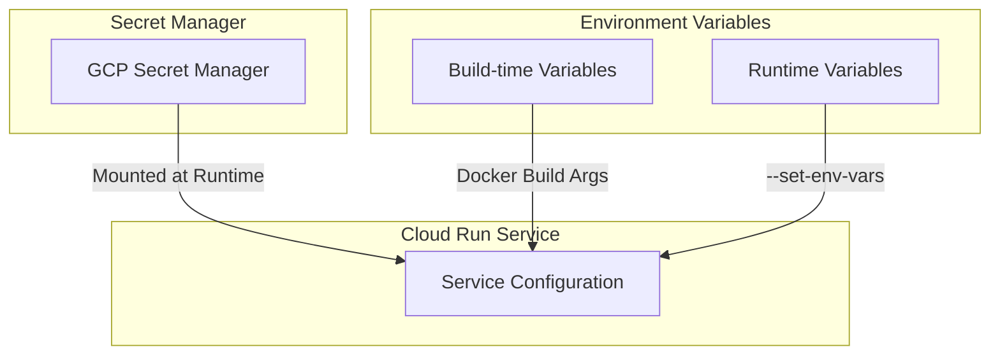

# Deployment Flow Diagram

> **FOR HUMAN CONSUMPTION ONLY** - AI agents should skip this folder

## CI/CD Pipeline



## Deployment Stages



## Service Deployment Order



## Rollback Flow



## Canary Deployment



## Environment Configuration



## Deployment Commands

### Manual Deployment

```bash
# API
cd kitesforu-api
./infra/deploy-api.sh

# Workers
cd kitesforu-workers
./infra/deploy-workers.sh

# Frontend
cd kitesforu-frontend
./infra/deploy-frontend.sh
```

### Verify Deployment

```bash
# List services
gcloud run services list --region=us-central1

# Check active revision
gcloud run services describe kitesforu-api \
  --region=us-central1 \
  --format="value(status.traffic[0].revisionName)"

# Health check
curl https://kitesforu-api-m6zqve5yda-uc.a.run.app/v1/health
```

## Artifact Registry

| Repository | Type | Contents |
|------------|------|----------|
| kitesforu-docker | Docker | API, Workers, Frontend images |
| kitesforu-python | Python | kitesforu-schemas package |
