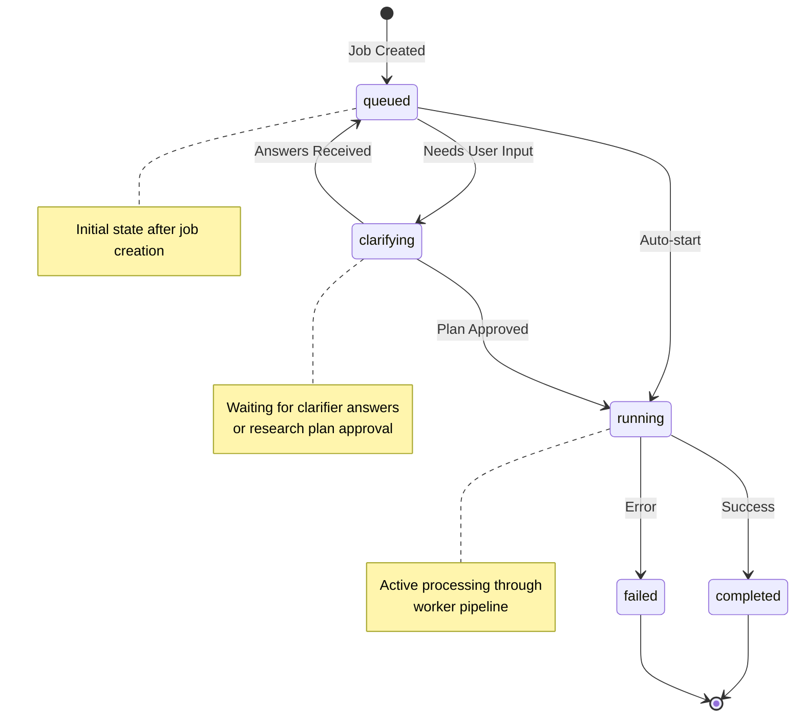
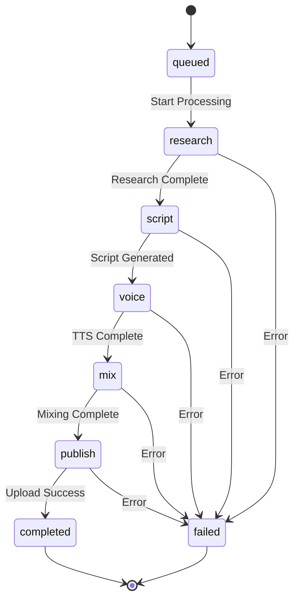
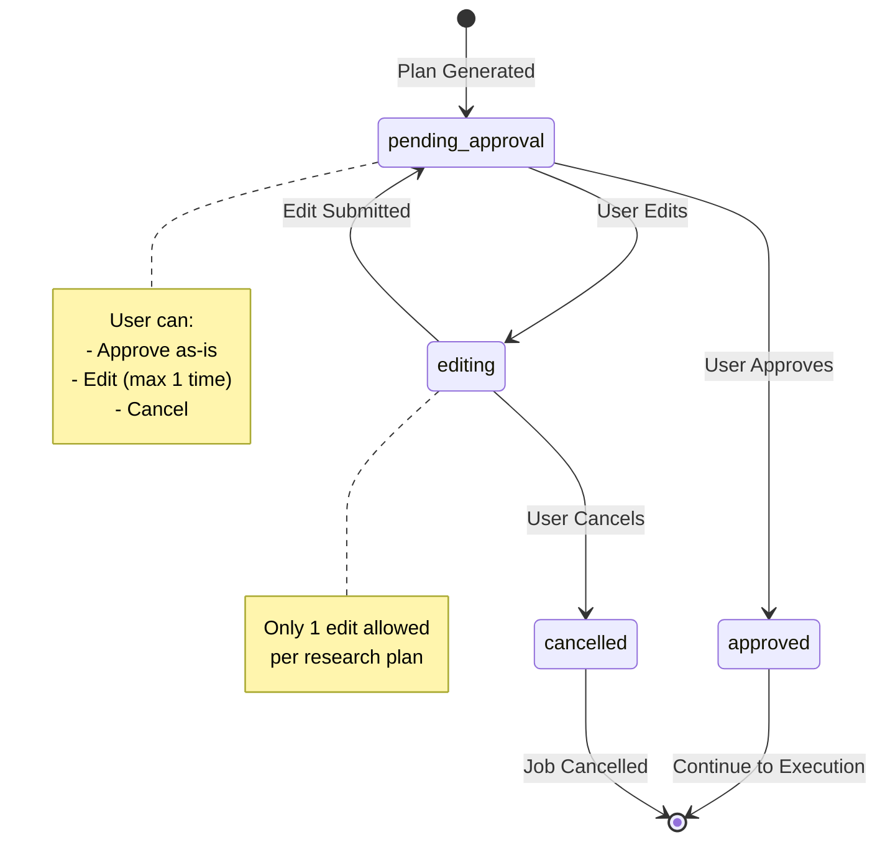
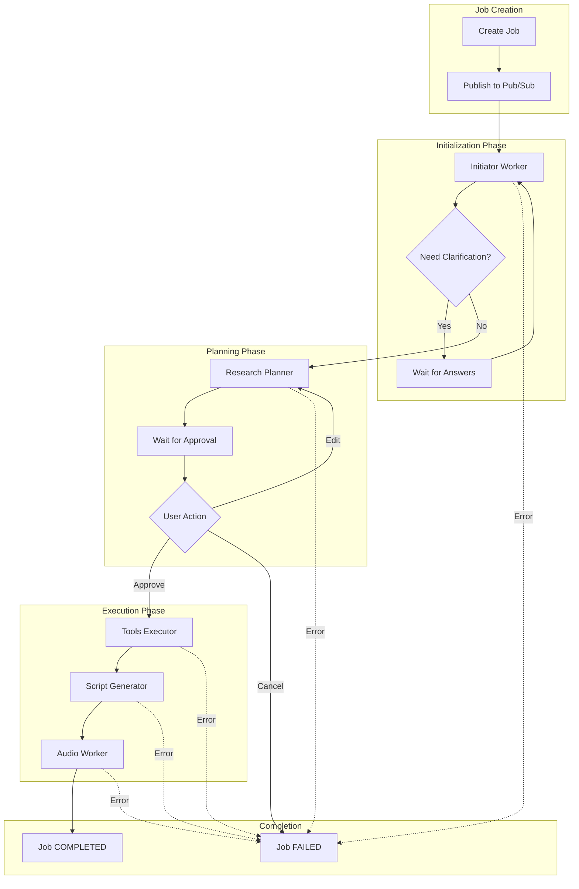

# Job State Machine Diagram

> **FOR HUMAN CONSUMPTION ONLY** - AI agents should skip this folder

## Job Status States

## Job Stage Progression

## Research Plan Approval Flow

## Combined State View

## State Descriptions

### JobStatus Values

| Status | Description | User Action |
|--------|-------------|-------------|
| `queued` | Job waiting to start | None |
| `clarifying` | Needs user input | Submit answers or approve plan |
| `running` | Active processing | Wait for completion |
| `completed` | Finished successfully | Play/download audio |
| `failed` | Error occurred | Check error, credits refunded |

### JobStage Values

| Stage | Description | Worker |
|-------|-------------|--------|
| `queued` | Initial state | - |
| `research` | Research in progress | Initiator, Planner, Tools |
| `script` | Script generation | Script Generator |
| `voice` | TTS synthesis | Audio Worker |
| `mix` | Audio mixing | Audio Worker |
| `publish` | Uploading to GCS | Audio Worker |
| `completed` | Done | - |
| `failed` | Error state | - |
