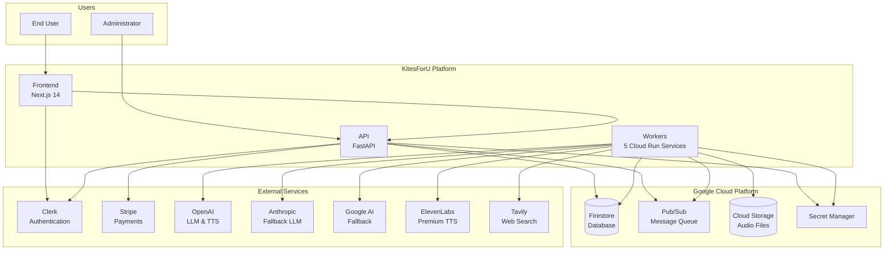

# System Context Diagram

> **FOR HUMAN CONSUMPTION ONLY** - AI agents should skip this folder

## Overview

High-level view of KitesForU system and its external integrations.

## System Context

## Component Descriptions

| Component | Technology | Purpose |
|-----------|------------|---------|
| Frontend | Next.js 14 | User interface, authentication UI |
| API | FastAPI | REST API, business logic, job management |
| Workers | Python | Background processing, AI integrations |
| Firestore | GCP | Document database for jobs, users, credits |
| Pub/Sub | GCP | Async message queue between services |
| Cloud Storage | GCP | Audio file storage |
| Clerk | SaaS | Authentication and user management |
| Stripe | SaaS | Payment processing and subscriptions |
| OpenAI | API | Primary LLM and TTS provider |
| Anthropic | API | Fallback LLM provider |
| Tavily | API | Web search for research |

## Data Flow Summary

1. **User Request**: User creates podcast via Frontend
2. **API Processing**: API validates, creates job, publishes to Pub/Sub
3. **Worker Pipeline**: Workers process through stages (research → script → audio)
4. **Result Delivery**: Audio uploaded to GCS, user notified
