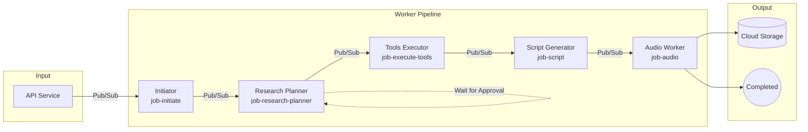
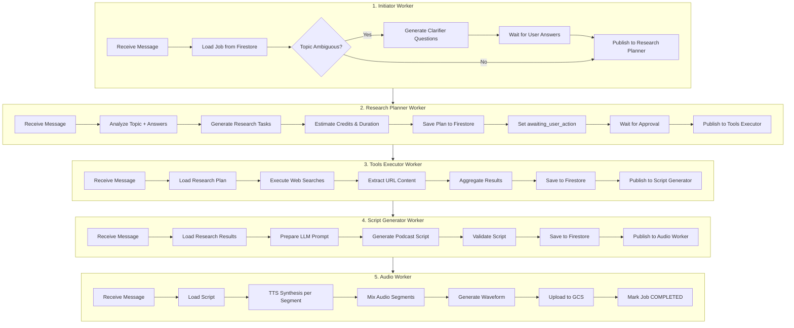
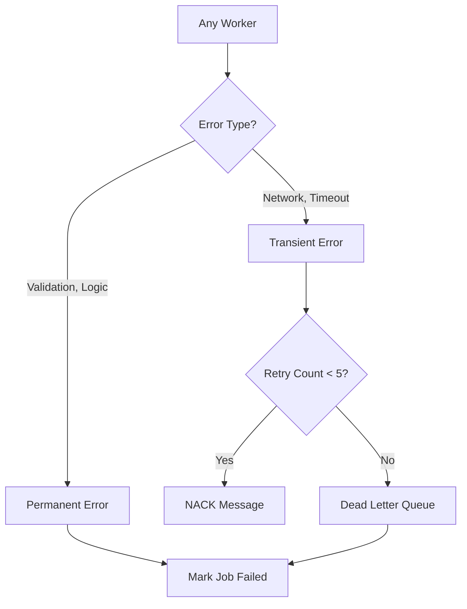

# Worker Pipeline Diagram

> **FOR HUMAN CONSUMPTION ONLY** - AI agents should skip this folder

## Pipeline Overview

## Detailed Worker Flow

## Worker Specifications

| Worker | Topic | Timeout | Memory | Budget |
|--------|-------|---------|--------|--------|
| Initiator | job-initiate | 120s | 512Mi | 0% |
| Research Planner | job-research-planner | 180s | 512Mi | 15% |
| Tools Executor | job-execute-tools | 300s | 1Gi | 30% |
| Script Generator | job-script | 480s | 512Mi | 40% |
| Audio Worker | job-audio | 300s | 1Gi | 25% |

## Error Handling

