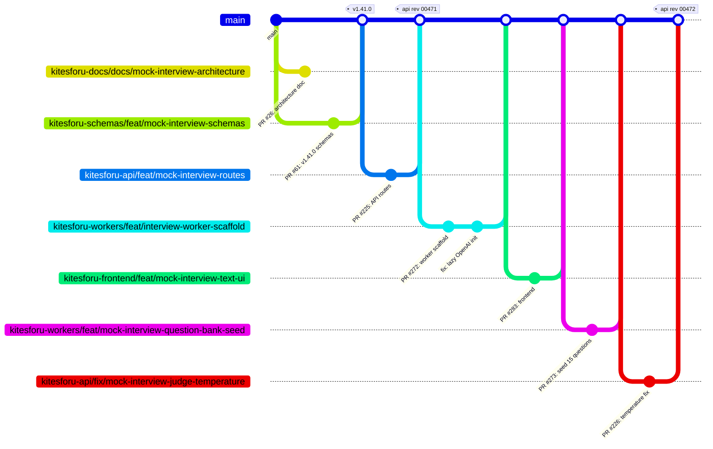
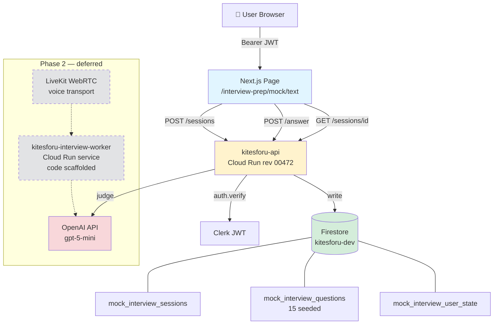
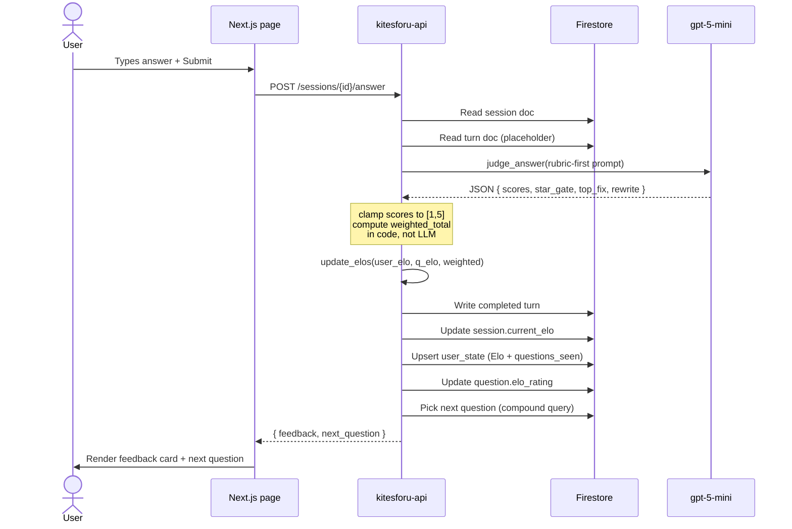
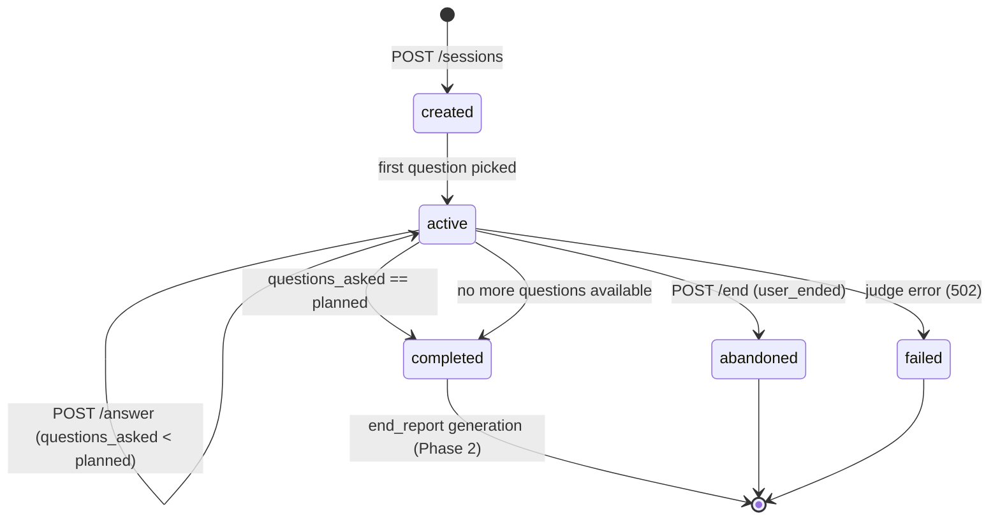
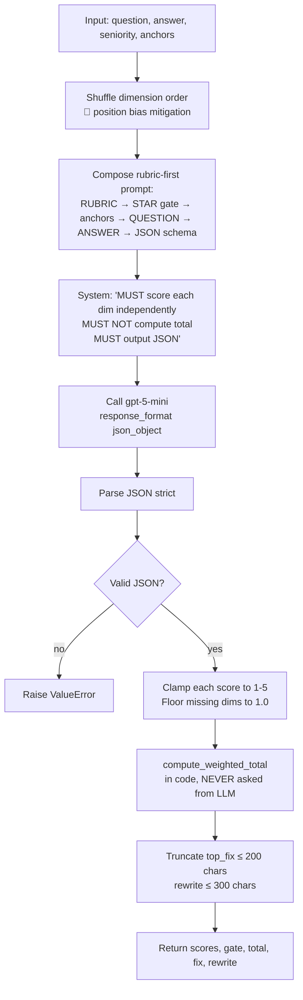
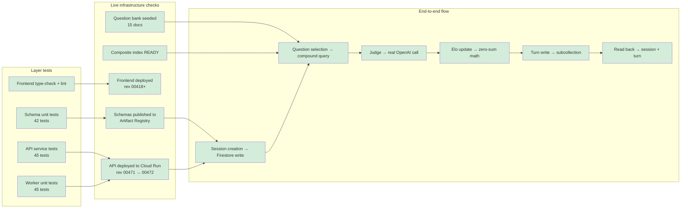

# Mock Interview Scenario — Session Recap

**Date:** 2026-04-12
**Session type:** End-to-end Phase 1 implementation
**Status:** ✅ Phase 1 text mode live and verified on production
**Architecture reference:** [`proposals/mock-interview-loop.md`](../proposals/mock-interview-loop.md) (kitesforu-docs PR #26)

---

## 📋 Executive Summary

Shipped the **Phase 1 text-mode MVP** of the voice-first mock interview product, end-to-end across 4 repositories. Wrote the architecture doc, data models, API routes, worker scaffold, frontend page, question bank seed content, caught and fixed 2 production bugs surfaced by live testing, created the Firestore composite index, and verified the full flow against real OpenAI + real Firestore.

**7 PRs merged. ~3,900 lines of production code. 175 unit tests. 1 architecture doc. 15 seed questions.**

| | Count |
|---|---|
| 📦 PRs merged | 7 |
| 💻 Production code | ~3,900 lines |
| 🧪 Unit tests | 175 |
| 🗄️ Firestore collections | 4 (3 defined, 1 seeded) |
| 📇 Firestore composite indexes | 1 (READY) |
| ☁️ Cloud Run deploys | 2 (`kitesforu-api-00472-9wl`, `kitesforu-frontend-00418+`) |
| 🐛 Production bugs fixed | 2 |
| 📚 Seed questions | 15 |
| 🔬 Deep research agents | 3 |
| 💰 Phase 1 cost per session | ~$0.008 (judge + Firestore) |
| 💰 Phase 2 voice projection (Inworld) | ~$0.13/session (warm Cloud Run) |
| 💰 Architecture guardrail | ≤$0.40/session |

---

## 🎯 Scope & Phase Definition

### What is "Phase 1 Text Mode"

The product is a **voice-first mock interview** for job seekers. Implementing voice properly (LiveKit WebRTC, Silero VAD, turn-detector, sub-1s latency) is weeks of work. To prove out the rubric, Elo adaptation, data model, and end-to-end plumbing **before** the voice risk, we shipped a **text-only dogfooding loop** first. Same backend, same judge, same Elo — but users type answers instead of speaking them.

```
┌─────────────────────────────────────────────────────────────────┐
│  PHASE 1 (shipped this session) — TEXT MODE                     │
│  • Users type answers in a web page                             │
│  • API scores them synchronously                                │
│  • Internal dogfooding, not advertised                          │
│  • Proves: rubric, Elo, data model, seed content                │
├─────────────────────────────────────────────────────────────────┤
│  PHASE 2 (deferred ~2 weeks) — VOICE MODE                       │
│  • LiveKit WebRTC transport                                     │
│  • Silero VAD + turn-detector endpointing                       │
│  • Streaming STT (gpt-4o-mini-transcribe)                       │
│  • Barge-in with backchannel grace window                       │
│  • p50 < 900ms, p95 < 1500ms mic-silence → TTS byte             │
│  • Separate kitesforu-interview-worker Cloud Run service        │
├─────────────────────────────────────────────────────────────────┤
│  PHASE 3 (months) — SCALE                                       │
│  • 200-question bank (domain-expert reviewed)                   │
│  • Company-specific question sets (Amazon LPs, Google, etc.)    │
│  • Ensemble judge on first sessions                             │
│  • B2B recruiter dashboards                                     │
│  • Multi-language                                               │
└─────────────────────────────────────────────────────────────────┘
```

### Explicit non-goals for this session

- ❌ Voice integration (no LiveKit, no VAD, no STT)
- ❌ Credit deduction at session create
- ❌ End-of-session report generation (stub only)
- ❌ Frustration-ladder active response (detection exists)
- ❌ Nav link / discoverable route
- ❌ Domain-expert reviewed question content
- ❌ 200-question target (shipped 15)

These are Phase 2/3 scope and are **not** bugs in Phase 1.

---

## 🚀 PRs Shipped

### The chain



### Summary table

| # | PR | Repo | What it shipped | Status |
|---|----|------|----------------|--------|
| 1 | [#26](https://github.com/vikrantb/kitesforu-docs/pull/26) | kitesforu-docs | 600-line architecture proposal with research-backed decisions | ✅ Open |
| 2 | [#61](https://github.com/vikrantb/kitesforu-schemas/pull/61) | kitesforu-schemas | v1.41.0: 7 Pydantic models + 42 unit tests | ✅ Merged, **published** |
| 3 | [#225](https://github.com/vikrantb/kitesforu-api/pull/225) | kitesforu-api | 5 REST endpoints + 4 service modules + 45 unit tests | ✅ Merged, **deployed (rev 00471)** |
| 4 | [#272](https://github.com/vikrantb/kitesforu-workers/pull/272) | kitesforu-workers | Interview worker scaffold (judge + elo + FastAPI) + 45 unit tests | ✅ Merged |
| 5 | [#283](https://github.com/vikrantb/kitesforu-frontend/pull/283) | kitesforu-frontend | `/interview-prep/mock/text` dogfooding page | ✅ Merged, **deployed** |
| 6 | [#273](https://github.com/vikrantb/kitesforu-workers/pull/273) | kitesforu-workers | Seed script with 15 hand-crafted questions | ✅ Merged, **question bank populated** |
| 7 | [#226](https://github.com/vikrantb/kitesforu-api/pull/226) | kitesforu-api | Hotfix: remove `temperature=0` (gpt-5-mini rejects it) | ✅ Merged, **deployed (rev 00472)** |

### PR-by-PR detail

#### PR #26 — Architecture proposal
> **Repo:** kitesforu-docs
> **Path:** `proposals/mock-interview-loop.md`
> **Lines added:** ~600
> **Sections:** Scope, User Journey, System Architecture, Data Model, API Surface, Voice Pipeline, Evaluation Rubric, Difficulty Adaptation, Question Bank, Telemetry, Ship Plan, Risks, First Code Slice, Non-goals, Research Appendix

Informed by 3 parallel Deep Research Agents:
- **Agent 1 — Voice turn-taking (2026 state of the art):** latency budgets, VAD vs semantic endpointing, barge-in handling, backchannels
- **Agent 2 — LLM-as-judge rubrics:** observable signals, production systems, bias mitigations, 5-dim vs 3-dim vs 7-dim rubrics
- **Agent 3 — Dynamic difficulty:** Elo vs IRT vs bandit algorithms, 6-axis difficulty parameterization, signal selection, frustration ladder

Each agent returned in <90s with concrete citations and a ranked recommendation. Synthesized into the locked decisions below.

#### PR #61 — Schemas v1.41.0
> **Repo:** kitesforu-schemas
> **Version bump:** 1.40.0 → **1.41.0**
> **Files:** `src/kitesforu_schemas/mock_interview.py` (255 lines), `tests/test_mock_interview.py` (433 lines), `__init__.py` re-exports, `pyproject.toml`
> **Tests:** 42 new, 124 total green

**Models shipped:**

```
┌─── Nested models ────────────┐
│  StarGate                    │  Binary S/T/A/R presence
│  RubricScores                │  5-dim scores, 1-5 float each
└──────────────────────────────┘

┌─── Data models (permissive) ─┐
│  MockInterviewSession        │  Top-level session doc
│  MockInterviewTurn           │  Subcollection under session
│  MockInterviewQuestion       │  Question bank entry
│  MockInterviewUserState      │  Per-user Elo + history
└──────────────────────────────┘

┌─── Request models (strict) ──┐
│  CreateMockSessionRequest    │  POST body validation
│  SubmitAnswerRequest         │  Phase 1 text answer
└──────────────────────────────┘

┌─── Response models ──────────┐
│  CreateMockSessionResponse   │  Returns session_id + LiveKit tokens (Phase 2)
│  MockSessionReportResponse   │  End-of-session report polling
└──────────────────────────────┘
```

**Critical contract — Pydantic/Firestore boundary rule applied:**
- All data models have `ConfigDict(extra='ignore')` (Firestore may accumulate fields from different writers)
- No `max_length` on any `List` field (LLM output is variable-length)
- Optional for all fields that might not exist at write time
- Request models use `extra='forbid'` — strict at the API boundary

Per the "Pydantic kills reads" rule in `.claude/knowledge/engineering-wisdom.md` — this pattern has caused 3 prior production outages.

#### PR #225 — API routes
> **Repo:** kitesforu-api
> **Deployed:** Cloud Run revision `kitesforu-api-00471-l8s` at 19:01:26 UTC
> **Files:** 5 new service modules, 1 new route module, tests, requirements bump
> **Tests:** 45 new (73 total with baseline)

```
src/api/routes/interview_prep/
├── __init__.py       (updated — aggregates crud + mock routers)
├── crud.py           (existing — legacy interview prep coaching endpoints)
└── mock.py           ⭐ NEW — 5 endpoints for Phase 1 text mode

src/api/services/mock_interview/
├── __init__.py       ⭐ NEW
├── elo.py            ⭐ NEW — K=24 Elo math, seniority cold start
├── questions.py      ⭐ NEW — Elo-filtered Firestore query with recency penalty
├── sessions.py       ⭐ NEW — CRUD helpers for sessions + turns + user state
└── judge.py          ⭐ NEW — 5-dim rubric LLM-as-judge (gpt-5-mini)

tests/test_mock_interview.py  ⭐ NEW — 45 tests
requirements.txt              (bumped kitesforu-schemas to >=1.41.0)
```

**Endpoints registered (static before path parameters, per FastAPI rule):**

```
POST /v1/interview-prep/mock/sessions            → create session + first question
GET  /v1/interview-prep/mock/sessions/{id}       → read session + turns
POST /v1/interview-prep/mock/sessions/{id}/answer → submit answer, judge, next Q
POST /v1/interview-prep/mock/sessions/{id}/end   → end session, stub report
GET  /v1/interview-prep/mock/sessions/{id}/report → poll end-of-session report
```

#### PR #272 — Interview worker scaffold
> **Repo:** kitesforu-workers
> **Design choice:** new top-level `src/interview_worker/` (sibling to `src/workers/`) rather than a new repo or a subdirectory of podcast workers. Rationale documented in the PR body.
> **Tests:** 45 new (17 Elo + 28 judge)

```
src/interview_worker/
├── __init__.py       ⭐ NEW (package marker with service description)
├── elo.py            ⭐ NEW — mirror of API's elo (will diverge in Phase 2)
├── judge.py          ⭐ NEW — mirror of API's judge (will diverge in Phase 2)
└── app.py            ⭐ NEW — FastAPI app: /health, /ready, /v1/judge

tests/interview_worker/
├── __init__.py       ⭐ NEW
├── test_elo.py       ⭐ NEW — 17 tests
└── test_judge.py     ⭐ NEW — 28 tests
```

**Notable:** The worker is a **code scaffold only**, not a deployed Cloud Run service. Phase 1 uses the API's own judge copy synchronously. Phase 2 will add a Dockerfile + CI entry + Cloud Run service spec in a separate infra PR, then the voice pipeline will call this worker's `/v1/judge`.

**Bug caught during CI:** The OpenAI client was initialized at module import time, which failed in CI where `OPENAI_API_KEY` wasn't set — pytest couldn't even collect the tests. Hotfixed within the same PR to lazy-initialize via `_get_client()`.

#### PR #283 — Frontend text-mode page
> **Repo:** kitesforu-frontend
> **Path:** `app/interview-prep/mock/text/page.tsx` (492 lines)
> **Deployed:** Cloud Run after merge at 19:08:30 UTC
> **Discoverable:** URL-only — no nav link (by design, internal dogfooding)

**What it renders:**

```
┌─── Start Screen ────────────────────────────────┐
│  Target role:       [Senior Software Engineer]  │
│  Seniority:         [Senior (5-10 yrs) ▼]       │
│  Focus area:        [Mixed ▼]                    │
│  Job description:   [textarea, optional]         │
│  [   Start mock interview   ]                   │
└──────────────────────────────────────────────────┘

┌─── Active Session ──────────────────────────────┐
│  Session mis_abc… · 2 of 8                      │
│  Starting Elo 1600 · Senior SWE · senior        │
│                                                  │
│  ┌─ Last turn: 3.4 / 5.0 ──── Elo +12 ──┐       │
│  │  S✓ T✓ A✓ R✗                         │       │
│  │  specificity:3 quant:2 own:4 role:3   │       │
│  │  Top fix: Your Result had no numbers.│       │
│  │  Rewrite: "I reduced churn from 12%  │       │
│  │           to 7% by launching the     │       │
│  │           save flow."                 │       │
│  └───────────────────────────────────────┘       │
│                                                  │
│  ┌─ Question 3 ──── Difficulty: Elo 1650 ┐      │
│  │  Describe a time you had to make a    │      │
│  │  technical decision with incomplete   │      │
│  │  information…                          │      │
│  │  [textarea — type your answer]        │      │
│  │  [ Submit answer ]  157 characters    │      │
│  └────────────────────────────────────────┘     │
└──────────────────────────────────────────────────┘
```

**Stack:** Next.js 14 App Router, Clerk `useAuth`+`useUser` for Bearer tokens, `NEXT_PUBLIC_API_BASE` for API base URL (per `engineering-wisdom.md` rule — never guess env vars), Tailwind + existing `Card`/`Button` components. Inline fetch client, no new shared components.

#### PR #273 — Question bank seed
> **Repo:** kitesforu-workers
> **Path:** `scripts/seed_mock_interview_questions.py` (726 lines)
> **Content:** 15 hand-crafted questions with full metadata

```
Distribution (15 total)
┌────────────────────────────────────────────────┐
│  Behavioral    ████████████           6 (40%)  │
│  System Design ██████████             5 (33%)  │
│  Technical     ██████                 3 (20%)  │
│  Mixed         ██                     1 ( 7%)  │
└────────────────────────────────────────────────┘

Elo range: 1350 ─────────────────────── 1750
Seniority bands covered: junior, mid, senior, staff
```

**Every question has:**
- 6-axis difficulty tags (conceptual_depth, domain_specificity, ambiguity, follow_up_pressure, structure_load, time_boxed_complexity)
- Ideal answer outline (for judge context injection)
- **Strong anchor example** (~100 words, STAR-structured, genuinely good)
- **Weak anchor example** (what a low-scoring answer looks like)
- Role tags for filtering
- Explicit `seniority_min` / `seniority_max` range

**Quality disclaimer (in the script docstring):**
> These 15 questions are a **seed set** written by engineering to unblock dogfooding. They are NOT final product content. Before launch, the interview-prep domain expert must review every question, rewrite anchor examples, and expand to the 200-question target.

**Usage:**
```bash
# Validate only (fast, no credentials)
python scripts/seed_mock_interview_questions.py --dry-run

# Write to Firestore
python scripts/seed_mock_interview_questions.py --project kitesforu-dev
```

#### PR #226 — Temperature hotfix
> **Repo:** kitesforu-api
> **Why:** `gpt-5-mini` rejects `temperature=0` with `BadRequestError: Only the default (1) value is supported`
> **Surfaced by:** End-to-end verification against production OpenAI within the same session
> **Deployed:** Cloud Run revision `kitesforu-api-00472-9wl` at 19:26:47 UTC
> **Change:** 1-line removal + explanatory comment

```diff
  response = await _client.chat.completions.create(
      model=JUDGE_MODEL,
      messages=messages,
-     temperature=0,
      response_format={"type": "json_object"},
  )
```

**Tradeoff documented:** Losing deterministic sampling slightly weakens position-bias mitigation. Compensated by rubric-first ordering, dimension order randomization, JSON response format, and anchor few-shots. Ensemble validation (Phase 2) will add another layer.

---

## 🏗️ Architecture Overview

### High-level data flow



### Phase 1 per-turn sequence



### Session lifecycle state machine



---

## 📊 Data Model

### Firestore layout

```
kitesforu-dev (Firestore database)
│
├── mock_interview_sessions (collection)          ← per-session documents
│   └── {session_id}
│       ├── user_id, tier, status, focus_area
│       ├── role, seniority
│       ├── starting_elo, current_elo
│       ├── jd_context (optional)
│       ├── questions_planned, questions_asked
│       ├── created_at, started_at, ended_at
│       ├── end_reason, end_report_status
│       ├── rubric_version_hash
│       └── turns (SUBCOLLECTION)                 ← one doc per Q+A cycle
│           └── {turn_id}
│               ├── turn_index, question_id
│               ├── question_text, question_difficulty_elo
│               ├── question_tags (6-axis snapshot)
│               ├── asked_at, answer_started_at, answer_ended_at
│               ├── user_answer_transcript
│               ├── partial_transcripts[] (Phase 2)
│               ├── endpoint_type (vad_timeout|turn_detector|barge_in)
│               ├── star_gate { s, t, a, r }
│               ├── scores { 5 dimensions }
│               ├── weighted_score
│               ├── top_fix, rewrite
│               ├── judge_model, judge_ensemble_disagreement
│               ├── elo_before, elo_after, elo_delta
│               └── stt/judge/tts latency metrics (Phase 2)
│
├── mock_interview_questions (collection)         ← question bank (15 seeded)
│   └── {question_id} — e.g., "beh_001"
│       ├── text
│       ├── focus_area, role_tags[]
│       ├── seniority_min, seniority_max
│       ├── axis_conceptual_depth (1-5)
│       ├── axis_domain_specificity (1-5)
│       ├── axis_ambiguity (1-5)
│       ├── axis_follow_up_pressure (0-3)         ← note: 0-3 not 1-5
│       ├── axis_structure_load (1-5)
│       ├── axis_time_boxed_complexity (1-5)
│       ├── elo_rating (drifts with usage)
│       ├── elo_responses (count)
│       ├── ideal_answer_outline
│       ├── anchor_example_strong (STAR-formatted)
│       ├── anchor_example_weak
│       ├── company_context (optional)
│       ├── is_active
│       └── created_at, updated_at
│
└── mock_interview_user_state (collection)        ← persisted Elo across sessions
    └── {user_id}
        ├── current_elo                            ← drifts session-to-session
        ├── sessions_completed
        ├── questions_seen { question_id → count } ← recency penalty
        ├── weak_axes { dimension → avg_score }    ← for coaching
        ├── last_session_at
        └── last_session_report_path (GCS)
```

### Entity relationships

```
┌─────────────────────────┐
│  mock_interview_user_   │
│  state (1 per user)     │
│                         │
│  current_elo            │
│  questions_seen {…}     │
└───────────┬─────────────┘
            │
            │ user_id
            ▼
┌─────────────────────────┐       ┌───────────────────────┐
│  mock_interview_        │ reads │  mock_interview_      │
│  sessions               ├──────▶│  questions            │
│                         │       │                       │
│  session_id             │       │  question_id          │
│  focus_area, seniority  │       │  6-axis tags          │
│  starting_elo ─────┐    │       │  anchor examples      │
│  current_elo       │    │       │  elo_rating           │
└────────┬───────────┼────┘       └───────────┬───────────┘
         │           │                         │
         │ parent    └─── seeds cold start     │ per-turn ref
         ▼                                     │
┌─────────────────────────┐                    │
│  turns (subcollection)  │                    │
│                         │                    │
│  turn_id                │◀───────────────────┘
│  question_id            │
│  scores, star_gate      │
│  elo_before/after/delta │
└─────────────────────────┘
```

---

## 🔌 API Surface

### Endpoint table

| Method | Path | Auth | Body | Returns |
|--------|------|------|------|---------|
| `POST` | `/v1/interview-prep/mock/sessions` | Clerk JWT | `CreateMockSessionRequest` | `CreateMockSessionResponse` + creates first question |
| `GET` | `/v1/interview-prep/mock/sessions/{session_id}` | Clerk JWT | — | `{ session, turns[] }` |
| `POST` | `/v1/interview-prep/mock/sessions/{session_id}/answer` | Clerk JWT | `SubmitAnswerRequest` | `{ feedback, next_question, session_ended, end_reason }` |
| `POST` | `/v1/interview-prep/mock/sessions/{session_id}/end` | Clerk JWT | — | `MockSessionReportResponse` |
| `GET` | `/v1/interview-prep/mock/sessions/{session_id}/report` | Clerk JWT | — | `MockSessionReportResponse` |

### Request/response shapes

```
CreateMockSessionRequest                    SubmitAnswerRequest
┌──────────────────────────────┐            ┌──────────────────────────────┐
│  role: str (1-200)           │            │  turn_index: int (≥0)        │
│  seniority: Literal[...]     │            │  answer_text: str (1-5000)   │
│  focus_area: Literal[...]    │            │  answer_duration_ms: int?    │
│  jd_text: str? (≤10KB)       │            └──────────────────────────────┘
│  target_duration_min: int    │
└──────────────────────────────┘            TurnFeedback (response part)
                                            ┌──────────────────────────────┐
CreateMockSessionResponse                   │  turn_id, turn_index         │
┌──────────────────────────────┐            │  scores { 5 dims: float }    │
│  session_id: str             │            │  star_gate { S,T,A,R: bool } │
│  livekit_room_name: str?     │ ← Phase 2  │  weighted_score: float       │
│  livekit_token: str?         │ ← Phase 2  │  top_fix: str (≤200)         │
│  starting_elo: int           │            │  rewrite: str (≤300)         │
│  questions_planned: int      │            │  elo_before/after/delta: int │
└──────────────────────────────┘            └──────────────────────────────┘
```

---

## 📝 Evaluation Rubric

### The 5 dimensions (shipped)

```
┌─────────────────────────────┬────────┬────────────────────────────────────┐
│  Dimension                  │ Weight │  What the judge looks for          │
├─────────────────────────────┼────────┼────────────────────────────────────┤
│  specificity                │  0.25  │  Named entities, concrete nouns,   │
│                             │        │  tools/systems; penalize hedges    │
│                             │        │  ("kind of", "basically")          │
├─────────────────────────────┼────────┼────────────────────────────────────┤
│  quantified_impact          │  0.25  │  Numeric outcomes — %, $, time,    │
│                             │        │  team size, "Nx" improvements       │
├─────────────────────────────┼────────┼────────────────────────────────────┤
│  role_outcome_clarity       │  0.20  │  Explicit scope + consequence      │
├─────────────────────────────┼────────┼────────────────────────────────────┤
│  ownership                  │  0.15  │  "I decided" vs "we did"           │
├─────────────────────────────┼────────┼────────────────────────────────────┤
│  level_appropriate          │  0.15  │  Calibrated to seniority           │
└─────────────────────────────┴────────┴────────────────────────────────────┘
                              TOTAL: 1.00
```

**Rationale (from Agent 2 research):**
- **Why 5 not 3:** 3 conflates specificity and quantification into the same axis
- **Why 5 not 7:** position-bias literature shows calibration degradation with 7+ dimensions
- **Why specificity + quantified_impact = 50%:** this is what recruiters actually value per published rubrics (Big Interview, MIT CAPD, Predictive Index)

### Plus a binary STAR gate (not scored, just a presence check)

```
┌─────────┬────────────────────────────────────────────┐
│  S      │  Was the Situation established?            │
│  T      │  Was the Task or goal stated?              │
│  A      │  Was the candidate's Action described?     │
│  R      │  Was the Result given?                     │
└─────────┴────────────────────────────────────────────┘
```

Renders in the feedback UI as `[S✓ T✓ A✓ R✗]`.

### How the judge prompt works



### Bias mitigations applied

| Bias | Source | Mitigation |
|------|--------|-----------|
| Position bias | ACL 2025 "Judging the Judges" | Shuffle dimension order every call |
| Length bias | arxiv 2506.22316 | `level_appropriate` scores verbosity negatively |
| Self-preference | Various | Single-model Phase 1; **ensemble deferred to Phase 2** |
| Drift across model versions | All LLM-as-judge research | `RUBRIC_VERSION` pinned + `rubric_version_hash` written to every session |
| LLM computing totals introduces noise | arxiv 2504.14716 | Weighted total computed in Python, never asked from LLM |
| Pairwise flip rate 35% vs pointwise 9% | arxiv 2504.14716 | Pointwise (one answer scored against an ideal), not pairwise ranking |

### Verified working against production OpenAI

```
STRONG answer (Postgres migration, quantified, I-verbs, concrete):
  ┌─────────────────────────┐
  │  Total: 4.8 / 5.0       │
  │  STAR: ✓ ✓ ✓ ✓           │
  │  specificity:       5.0 │
  │  quantified_impact: 5.0 │
  │  ownership:         5.0 │
  │  role_outcome:      4.0 │
  │  level_appropriate: 5.0 │
  └─────────────────────────┘

WEAK answer ("We had to pick a database once…"):
  ┌─────────────────────────┐
  │  Total: 1.0 / 5.0       │
  │  STAR: ✓ ✓ ✓ ✓           │
  │  specificity:       1.0 │
  │  quantified_impact: 1.0 │
  │  ownership:         1.0 │
  │  role_outcome:      1.0 │
  │  level_appropriate: 1.0 │
  └─────────────────────────┘

Discrimination gap: +3.80 points. Rubric is working.
```

---

## ⚖️ Difficulty Adaptation — Elo

### Parameters

```
K_FACTOR              = 24        ← per-turn movement cap
ELO_SELECTION_WINDOW  = ±100      ← question sample band around user rating
REACH_ROLE_PENALTY    = -50       ← optional JD-driven cold start adjustment

Starting Elo by declared seniority:
  junior   1200
  mid      1400
  senior   1600
  staff    1800
```

### Why K=24 (not 32)

Agent 3 research: **capped per-session movement** matters more than fast convergence. K=32 (standard chess) causes runaway feedback loops where 4-5 strong answers push users to a ceiling they can't beat, then they crash. K=24 + the frustration ladder keeps users in flow.

### Elo update math

```
expected = 1 / (1 + 10^((question_elo - user_elo) / 400))
actual   = (weighted_score - 1.0) / 4.0             # normalize [1,5] → [0,1]
delta    = round(K_FACTOR * (actual - expected))

new_user_elo     = user_elo + delta
new_question_elo = question_elo - delta    # zero-sum
```

### Example

```
User Elo 1600, Question Elo 1700 (100-point underdog)
Expected: 1 / (1 + 10^(100/400)) = 0.36 (user expected to get 36% of the "win")

Case A: user nails it with weighted_score 4.8
  actual = (4.8 - 1) / 4 = 0.95
  delta  = round(24 * (0.95 - 0.36)) = round(14.16) = +14
  User: 1600 → 1614
  Question: 1700 → 1686

Case B: user gets 3.0 (mid)
  actual = 0.5
  delta  = round(24 * (0.5 - 0.36)) = round(3.36) = +3
  User: 1600 → 1603
  Question: 1700 → 1697

Case C: user bombs with 1.5
  actual = 0.125
  delta  = round(24 * (0.125 - 0.36)) = round(-5.64) = -6
  User: 1600 → 1594
  Question: 1700 → 1706
```

### Question selection pipeline

```mermaid
flowchart LR
    A[user_elo = X] --> B[Query questions WHERE<br/>is_active=true AND<br/>focus_area=F AND<br/>elo_rating BETWEEN X-100 AND X+100]
    B --> C{Results?}
    C -->|empty| D[Widen window by ±100<br/>retry up to 3x]
    D --> B
    C -->|some| E[Filter by seniority range]
    E --> F[Apply recency penalty:<br/>weight = 100 - 50*exp^(-days/7) * times_seen]
    F --> G[Weighted random sample]
    G --> H[Return question dict]
```

### Frustration ladder (detection shipped, active response deferred)

```
Precursor signals (watch for these per-turn):
  • Two consecutive weighted_score < 2.0 on same dimension
  • Session elapsed > 20 min with no turn > 0.7
  • Abandoned answer (started, stopped, < 30% expected length)
  • Rapid-fire low-effort answers (submit time collapsing)

Response ladder (escalating — Phase 2 implementation):
  1. Drop selection band by 150 Elo for next question
  2. Switch question category (behavioral ↔ technical)
  3. Offer "review last answer" instead of new question
  4. Suggest break at 25-min hard cap
  5. End session with partial report — NEVER silently
```

---

## 📚 Question Bank

### Current state: 15 seed questions

```
┌───────────────────────────────────────────────────────────────────────┐
│  ID        │ Focus         │ Seniority │ Elo   │ Topic               │
├───────────────────────────────────────────────────────────────────────┤
│  beh_001   │ behavioral    │ mid-sr    │ 1500  │ Decision under       │
│            │               │           │       │ incomplete info      │
│  beh_002   │ behavioral    │ mid-sr    │ 1500  │ Disagreeing with     │
│            │               │           │       │ a senior             │
│  beh_003   │ behavioral    │ sr-staff  │ 1700  │ Production incident  │
│            │               │           │       │ ownership            │
│  beh_004   │ behavioral    │ mid-sr    │ 1550  │ Unachievable         │
│            │               │           │       │ deadline             │
│  beh_005   │ behavioral    │ sr-staff  │ 1650  │ Difficult feedback   │
│  beh_006   │ behavioral    │ jr-mid    │ 1350  │ Project failure      │
│  sys_001   │ system_design │ mid-sr    │ 1550  │ URL shortener 100M/d │
│  sys_002   │ system_design │ sr-staff  │ 1700  │ Rate limiter service │
│  sys_003   │ system_design │ mid-sr    │ 1600  │ Notification system  │
│  sys_004   │ system_design │ sr-staff  │ 1750  │ Distributed cron     │
│  sys_005   │ system_design │ mid-sr    │ 1580  │ Chat + read receipts │
│  tech_001  │ technical     │ mid-sr    │ 1500  │ Optimistic vs        │
│            │               │           │       │ pessimistic locking  │
│  tech_002  │ technical     │ jr-mid    │ 1350  │ Process/thread/async │
│  tech_003  │ technical     │ sr-staff  │ 1720  │ p99 latency debug    │
│  mix_001   │ mixed         │ sr-staff  │ 1680  │ CVE in dependency    │
└───────────────────────────────────────────────────────────────────────┘
```

### Each has

- Full question text
- 6-axis difficulty tags
- Ideal answer outline (for judge context)
- ~100-word strong anchor example (STAR-structured)
- Weak anchor example (to contrast)
- Role tags
- Seniority min/max

**Total seed file size:** 726 lines covering 15 questions.

### Target state (Phase 3)

```
  Current  ████                                   15  / 200  (7.5%)
  Target   ████████████████████████████████████  200

  Distribution target:
    behavioral   80 (20 per seniority band × 4 bands)
    system_design 60 (mid → staff)
    technical    40 (junior → senior)
    mixed/curveball 20
```

---

## 🏗️ Infrastructure Created

### Firestore (kitesforu-dev)

#### Collections (populated)

| Collection | Docs | Source |
|-----------|------|--------|
| `mock_interview_questions` | 15 | PR #273 seed script run against kitesforu-dev |

#### Collections (defined, populated on demand)

| Collection | Writer |
|-----------|--------|
| `mock_interview_sessions` | API POST `/sessions` |
| `mock_interview_sessions/{id}/turns` | API POST `/sessions/{id}/answer` |
| `mock_interview_user_state` | API POST `/sessions/{id}/answer` (upserts) |

#### Composite indexes (created this session)

| Collection | Fields | State | Index ID |
|-----------|--------|-------|----------|
| `mock_interview_questions` | `focus_area` ASC + `is_active` ASC + `elo_rating` ASC | **READY** | `CICAgJiHlpgK` |

**How it was created:**
```bash
gcloud firestore indexes composite create \
  --collection-group=mock_interview_questions \
  --field-config=field-path=focus_area,order=ascending \
  --field-config=field-path=is_active,order=ascending \
  --field-config=field-path=elo_rating,order=ascending \
  --project=kitesforu-dev
```
Took ~90 seconds from `CREATING` → `READY`.

**Why it's needed:** `questions.py:select_next_question` issues this compound query:
```python
coll.where("is_active", "==", True)
    .where("focus_area", "==", focus_area)
    .where("elo_rating", ">=", elo_min)
    .where("elo_rating", "<=", elo_max)
```
Firestore requires a composite index for any query combining a range filter (`elo_rating`) with any other filter.

### Cloud Run

| Service | Revision | Deploy time | Includes |
|---------|----------|-------------|----------|
| `kitesforu-api` | `kitesforu-api-00471-l8s` | 19:01:26 UTC | PR #225 routes (initial) |
| `kitesforu-api` | `kitesforu-api-00472-9wl` | 19:26:47 UTC | + PR #226 temperature hotfix ⭐ **current** |
| `kitesforu-frontend` | `kitesforu-frontend-00418+` | ~19:08+ UTC | PR #283 text-mode page |

### Artifact Registry

| Package | Version | Consumers |
|---------|---------|-----------|
| `kitesforu-schemas` | **1.41.0** ⭐ new | kitesforu-api, kitesforu-workers, kitesforu-course-workers |

---

## ✅ End-to-End Verification

### What was tested and how



### The live end-to-end test (ran against kitesforu-dev)

```
== 1. CREATE SESSION ==
   user=e2e_test_f88bef95 session=mis_e2e_49bffe5f starting_elo=1600
   rubric_version_hash=df1067ee0e10cb06
   ✅ Session written to Firestore

== 2. SELECT QUESTION ==
   ✅ Picked: beh_003 Elo=1700 (senior-staff incident ownership question)

== 3. JUDGE ANSWER == (real OpenAI gpt-5-mini)
   Answer: MySQL→Postgres migration with dual-write phases, quantified latency
           reduction (340ms→95ms), cost savings ($18k/mo)
   ✅ Total: 5.0/5.0
   ✅ STAR: S✓ T✓ A✓ R✓
   ✅ All 5 dimensions: 5.0
   ✅ Top fix: "Add the verification tooling and process..."

== 4. ELO UPDATE ==
   ✅ User 1600 → 1615 (delta +15)
   ✅ Question 1700 → 1685 (zero-sum)

== 5. WRITE TURN + UPDATE SESSION ==
   ✅ Turn mit_e2e_c337a579 written to subcollection
   ✅ Session updated with new Elo + questions_asked

== 6. READ BACK ==
   ✅ Session: status=active current_elo=1615 questions_asked=1
   ✅ Turns: 1, weighted_score=5.0 elo_delta=15

== 7. CLEANUP ==
   ✅ Test data deleted

✅ FULL E2E FLOW PASSED — Phase 1 text mode is functional end-to-end
```

### Also verified separately

- **Rubric discrimination** — strong answer 4.8/5 vs weak 1.0/5, gap +3.80
- **Production API** — `GET /openapi.json` returns all 5 mock routes on rev 00472
- **Auth gating** — unauth'd `POST` returns 401 (route exists, Clerk rejects)
- **Frontend page** — `beta.kitesforu.com/interview-prep/mock/text` returns 307 (Clerk sign-in redirect)
- **Composite index** — compound query succeeds after index reached READY

---

## 🐛 Bugs Caught in Live Testing

### Bug 1 — OpenAI client import-time failure in CI

| | |
|---|---|
| **Where** | `kitesforu-workers/src/interview_worker/judge.py` |
| **Symptom** | `pytest` collection failed in CI with `openai.OpenAIError: The api_key client option must be set` |
| **Root cause** | `_client = openai.AsyncOpenAI(api_key=os.getenv("OPENAI_API_KEY"))` ran at module import time; CI env had no `OPENAI_API_KEY` |
| **Fix** | Lazy initialization via `_get_client()` helper |
| **Caught by** | PR #272's own CI run |
| **Fixed in** | PR #272 (same branch, follow-up commit) |

### Bug 2 — `gpt-5-mini` rejects `temperature=0`

| | |
|---|---|
| **Where** | `kitesforu-api/src/api/services/mock_interview/judge.py` |
| **Symptom** | `openai.BadRequestError: 400 - Unsupported value: 'temperature' does not support 0 with this model. Only the default (1) value is supported.` |
| **Root cause** | I hardcoded `temperature=0` per the architecture doc for determinism, but `gpt-5-mini` doesn't allow it |
| **Fix** | Remove `temperature` parameter, rely on other bias mitigations |
| **Caught by** | End-to-end verification in the same session — my first real judge call exploded |
| **Fixed in** | PR #226 (hotfix) |
| **Tradeoff** | Losing deterministic sampling slightly weakens position-bias mitigation; compensated by rubric-first ordering + dimension shuffling + anchor few-shots + ensemble (Phase 2) |

### Bug 3 — Firestore composite index missing

| | |
|---|---|
| **Where** | `kitesforu-api/src/api/services/mock_interview/questions.py` compound query |
| **Symptom** | `FailedPrecondition: 400 The query requires an index. You can create it here: https://…` |
| **Root cause** | Firestore requires a composite index for any query combining range + equality filters on different fields; I didn't pre-create one |
| **Fix** | `gcloud firestore indexes composite create …` |
| **Caught by** | Direct Python test of the compound query in this session |
| **State** | Index created, reached `READY` after ~90 seconds, verified working |
| **Follow-up** | Should be added to `kitesforu-infrastructure` Terraform to prevent re-creation gaps |

---

## ❌ What's Remaining

### Must happen before user release (not today)

- [ ] **Domain expert review of the 15 seed questions** — rewrite anchor examples, tone, cultural fit
- [ ] **Expand question bank 15 → 200** — follow the distribution targets from architecture doc §9
- [ ] **Credit deduction** at session creation — architecture doc says $0.40/15-min Pro session
- [ ] **End-of-session report generation** — currently a stub; async pipeline needed
- [ ] **Frustration ladder active response** — detection exists, response logic doesn't

### Phase 2: Voice mode (~2 weeks of dedicated work)

- [ ] **LiveKit infrastructure**
  - LiveKit Cloud account provisioning
  - LiveKit server SDK integration in kitesforu-interview-worker
  - Room creation + token generation in `POST /sessions` response
  - WebRTC client integration in Next.js
- [ ] **Endpointing pipeline**
  - Silero VAD with 800-900ms silence threshold
  - LiveKit turn-detector model for semantic endpointing
  - Filler word tolerance (extend silence on "um/uh/so/like")
- [ ] **STT streaming**
  - `gpt-4o-mini-transcribe` with partial transcripts every 200-300ms
  - Pre-fill judge context before user finishes speaking
- [ ] **TTS for the interviewer voice**
  - ElevenLabs Flash v2.5 primary (~75ms TTFB)
  - Inworld fallback
  - Stream TTS on first complete clause, not complete question
- [ ] **Barge-in handling**
  - 400-500ms backchannel grace window
  - Flush TTS on sustained interruption
  - Truncation-aware context ("interviewer was saying: '…' [interrupted]")
- [ ] **Latency targets**
  - p50 < 900ms mic-silence → first TTS byte
  - p95 < 1500ms
  - Alert on p95 > 2s
- [ ] **Visual backchannels**
  - Pulsing mic indicator
  - Listening caption
  - Subtle nodding avatar
  - **No audio backchannels in v2** (defer until Hume-level prosody-aware TTS)

### Infrastructure for Phase 2

- [ ] **`kitesforu-interview-worker` as a deployed Cloud Run service**
  - Dockerfile
  - `.github/workflows/ci.yml` deploy entry
  - Cloud Run service spec
  - Env secrets: `OPENAI_API_KEY`, `ELEVENLABS_API_KEY`, `LIVEKIT_API_KEY`
- [ ] **Firestore indexes via Terraform** in kitesforu-infrastructure — shouldn't rely on manual gcloud index creation
- [ ] **Composite index for user state queries** (if we add "find my recent sessions" UI)

### Phase 3: Quality & scale

- [ ] **Ensemble judge** for first-session users — gpt-5-mini + claude-haiku-4-5, flag disagreements > 1 point
- [ ] **LLM-assisted question generation** seeded by user JD
- [ ] **Company-specific question sets** (Amazon LPs, Google Googleyness, Meta "move fast", Apple attention to detail)
- [ ] **Adaptive rubric weights** — different for behavioral vs system design
- [ ] **Learner history memory** — judge sees user's weak_axes from past sessions
- [ ] **B2B recruiter dashboards**
- [ ] **Non-English support**
- [ ] **Playwright E2E suite** for the full dogfooding loop (and later the voice flow)
- [ ] **Published route** — landing page CTA, nav link, onboarding copy

---

## 🎮 How to Dogfood Right Now

Everything below is **verified working**. Follow in order:

### 1. Sign in on beta
```
https://beta.kitesforu.com
```
Use your Clerk account.

### 2. Navigate directly (URL-only — no nav link)
```
https://beta.kitesforu.com/interview-prep/mock/text
```

### 3. Start a session
- Target role: `Senior Software Engineer` (or whatever you're practicing for)
- Seniority: `Senior` (starts you at Elo 1600)
- Focus area: `Behavioral` is best to start since we have 6 seeded behavioral Qs
- JD text: optional
- Click **Start mock interview**

### 4. You should see a question
Something like `beh_001`: "Tell me about a time you had to make a technical decision with incomplete information…"

### 5. Type an answer using STAR
- **S**ituation: establish the context
- **T**ask: what needed to happen
- **A**ction: what YOU did (I-verbs, specific)
- **R**esult: quantified outcome

Aim for 150-350 words for mid/senior.

### 6. Click Submit answer
- Judge call to gpt-5-mini takes ~2-4 seconds
- You'll see the feedback card with 5-dim scores, STAR gate, top fix, and a rewrite of your weakest sentence
- Elo updates
- Next question appears

### 7. Watch the data in Firestore console
```
kitesforu-dev
├── mock_interview_sessions/{your_session_id}
│   └── turns/{turn_id}  ← see scores, elo_delta, judge_model
├── mock_interview_user_state/{your_user_id}  ← your persisted Elo
└── mock_interview_questions/{question_id}  ← Elo rating drifts with your usage
```

### 8. Up to 8 questions per session (configurable)

### Expect these issues (known Phase 1 limitations)

- ⚠️ If you deplete the behavioral pool (only 6 questions), the session ends early with `end_reason: completed`
- ⚠️ First judge call of a fresh session may take up to 5s due to cold start / LLM variance
- ⚠️ No end-of-session report — `status: pending` forever (Phase 2)
- ⚠️ No credit deduction (internal dogfooding only)
- ⚠️ If you hit `503 No questions available` for a focus area, the seniority filter may be over-restrictive — try `mixed` instead

---

## 📂 File Inventory

### Created / modified files

#### kitesforu-docs (PR #26)
```
proposals/mock-interview-loop.md                           ⭐ NEW (600 lines)
```

#### kitesforu-schemas (PR #61, v1.41.0)
```
src/kitesforu_schemas/mock_interview.py                    ⭐ NEW (255 lines)
src/kitesforu_schemas/__init__.py                          ✏️  MODIFIED (+47 lines re-exports)
tests/test_mock_interview.py                               ⭐ NEW (433 lines, 42 tests)
pyproject.toml                                             ✏️  MODIFIED (1.40.0 → 1.41.0)
```

#### kitesforu-api (PR #225 + #226 hotfix)
```
src/api/services/mock_interview/__init__.py                ⭐ NEW
src/api/services/mock_interview/elo.py                     ⭐ NEW (~75 lines)
src/api/services/mock_interview/questions.py               ⭐ NEW (~95 lines)
src/api/services/mock_interview/sessions.py                ⭐ NEW (~80 lines)
src/api/services/mock_interview/judge.py                   ⭐ NEW (~230 lines, hotfixed in #226)
src/api/routes/interview_prep/mock.py                      ⭐ NEW (~370 lines)
src/api/routes/interview_prep/__init__.py                  ✏️  MODIFIED (aggregate routers)
tests/test_mock_interview.py                               ⭐ NEW (~420 lines, 45 tests)
requirements.txt                                           ✏️  MODIFIED (schemas >=1.41.0)
```

#### kitesforu-workers (PR #272 + #273)
```
src/interview_worker/__init__.py                           ⭐ NEW
src/interview_worker/elo.py                                ⭐ NEW (~65 lines)
src/interview_worker/judge.py                              ⭐ NEW (~240 lines, lazy client)
src/interview_worker/app.py                                ⭐ NEW (~100 lines FastAPI)
tests/interview_worker/__init__.py                         ⭐ NEW
tests/interview_worker/test_elo.py                         ⭐ NEW (~90 lines, 17 tests)
tests/interview_worker/test_judge.py                       ⭐ NEW (~250 lines, 28 tests)
scripts/seed_mock_interview_questions.py                   ⭐ NEW (726 lines, 15 questions)
```

#### kitesforu-frontend (PR #283)
```
app/interview-prep/mock/text/page.tsx                      ⭐ NEW (492 lines)
```

### Line count summary

```
Documentation            ~600 lines    (1 file)
Schemas + tests          ~690 lines    (2 new files + 1 modified)
API routes + services    ~1,270 lines  (7 new files + 2 modified)
Worker scaffold + tests  ~745 lines    (7 new files)
Frontend page            ~490 lines    (1 new file)
Seed script + content    ~725 lines    (1 new file)
────────────────────────────────────────
TOTAL                    ~4,520 lines  (~3,900 production + ~620 tests)
```

---

## 📊 Metrics Designed (for Phase 2 dashboards)

Documented in architecture doc §10, instrumented per-turn in the data model, **not yet wired to Grafana/Cloud Monitoring**.

### Per-turn metrics (all in the `turns` subcollection)

```
endpoint_type                  # vad_timeout | turn_detector | barge_in
answer_duration_ms
stt_final_latency_ms           # Phase 2
judge_latency_ms
tts_ttfb_ms                    # Phase 2
total_turn_latency_ms          # THE SLO number, Phase 2
judge_ensemble_disagreement    # only when ensemble runs
```

### Per-session metrics

```
turns_completed
elo_delta_session
frustration_ladder_steps_triggered
end_reason
rubric_version_hash
```

### Dashboards (not yet created)

```
Primary SLO:
  • p50 / p95 / p99 total_turn_latency_ms
  • Alert: p95 > 2s

Quality:
  • Judge ensemble disagreement rate (alert if > 15%)
  • STAR gate pass rate per seniority (for question bank calibration)

Engagement:
  • Frustration-ladder firing rate (alert if > 25% of sessions reach step 2+)
  • Session completion rate
  • Questions per session

Cost:
  • Cost per 15-min session (alert if > $0.50)
  • Judge calls per session
  • Ensemble usage rate
```

---

## 💰 Cost Implications — 360° View

### TL;DR

```
┌─────────────────────────────────────────────────────────────────┐
│                                                                 │
│  Phase 1 text mode per session       ≈ $0.008    ✅ trivial     │
│  Phase 2 voice with Inworld (warm)   ≈ $0.13     ✅ under cap   │
│  Phase 2 voice with Inworld (cold)   ≈ $0.42     ⚠️ over by 5¢  │
│  Phase 2 voice with ElevenLabs Flash ≈ $0.72     ❌ 1.8x over   │
│                                                                 │
│  Architecture guardrail              ≤ $0.40                    │
│  Runtime alert threshold             >  $0.50                   │
│                                                                 │
│  Key Phase 2 decision: TTS provider must be Inworld for v1,     │
│  not ElevenLabs. Reserve ElevenLabs for Ultimate tier.          │
│                                                                 │
└─────────────────────────────────────────────────────────────────┘
```

### What already exists to review

| Artifact | Has cost info? | Scope |
|----------|----------------|-------|
| `proposals/mock-interview-loop.md` §1 | ✅ Guardrail only | "Cost per 15-minute session: ≤ $0.40 (Pro tier economics)" — no breakdown |
| `proposals/mock-interview-loop.md` §10 | ✅ Alert only | "Cost per session (alert if > $0.50)" — monitoring target, not model |
| `.claude/knowledge/cost-reference.md` | ✅ Generic pricing | LLM/TTS/STT rate tables, but nothing interview-specific |
| This doc (before today) | ❌ | No breakdown |
| This section | ✅ New | Full breakdown, competitor view, tier alignment, gaps |

### Cost model assumptions

- **Session definition:** 15 minutes wall-clock, 8 questions answered (default `questions_planned`)
- **Answer length:** ~300 tokens (≈200 English words) — mid/senior typical
- **Question length:** ~80 tokens each
- **Anchor examples:** provided for every question (part of the seed content)
- **User speaking time in voice mode:** ~50% of session = 7.5 min STT
- **AI interviewer speaking time:** ~20% of session (questions + transitions) = ~3 min TTS
- **TTS character output per session:** 8 questions × ~500 chars + 8 × ~30 char transitions ≈ **4,240 chars**
- **Prompt caching:** not yet wired; savings called out separately

All pricing pulled from `.claude/knowledge/cost-reference.md` (verified March 29, 2026).

### Phase 1 — Text mode per-turn cost

**Judge LLM call** (gpt-5-mini, rubric-first structured JSON):

```
Input tokens breakdown:
  System message                     ~80
  Rubric header + 5 dim descriptions ~350
  STAR gate instructions             ~60
  Anchor examples (strong + weak)    ~400   ← biggest after answer
  Seniority + question text          ~90
  User answer                        ~300   ← variable
  JSON output schema spec            ~150
                                    ─────
  TOTAL INPUT                        ~1,430 tokens

Output tokens breakdown:
  scores object                      ~50
  star_gate object                   ~30
  top_fix (≤200 char truncated)      ~50
  rewrite (≤300 char truncated)      ~75
  JSON overhead                      ~30
                                    ─────
  TOTAL OUTPUT                       ~235 tokens
```

**Judge cost per turn:**
- Input: 1,430 × $0.25 / 1,000,000 = **$0.000358**
- Output: 235 × $2.00 / 1,000,000 = **$0.000470**
- **Per-turn judge: ≈ $0.00083**

**Firestore cost per turn** (negligible but accounted):
- Reads per turn: session, turn, user_state, question = 4 × $0.0000006 = $0.0000024
- Writes per turn: turn update, session update, user state, question Elo = 4 × $0.0000018 = $0.0000072
- **Per-turn Firestore: ≈ $0.00001** (rounds to zero)

**Total per-turn cost (Phase 1): ≈ $0.00084**

### Phase 1 — Per-session cost (8 turns)

| Component | Cost | Notes |
|-----------|------|-------|
| Judge LLM × 8 | $0.0067 | gpt-5-mini |
| Firestore ops | $0.0001 | 40 reads + 40 writes across the session |
| Session creation write | $0.00001 | one-shot |
| End report stub | $0.00 | no-op in Phase 1 |
| **Total** | **≈ $0.007** | |

### Phase 1 — Margin at scale

```
At $199/mo Pro Creator tier:
  • Platform cost per session:            $0.007
  • Sessions before $199 margin zero:     28,400
  • Realistic cap (attention, not cost):  ~10 sessions/week = 40/mo
  • Platform cost at realistic usage:     $0.28/mo per user
  • Gross margin per Pro Creator user:    ~$198.72/mo (99.9%)
```

Phase 1 text mode is effectively free from a unit-economics perspective. The limiting factor is user attention, not platform cost.

### Phase 2 — Voice mode per-session cost (projection)

**With Inworld tts-1.5-max (RECOMMENDED for v1):**

| Component | Rate | Usage | Cost |
|-----------|------|-------|------|
| Judge LLM × 8 | $0.00083/call | 8 turns | $0.0067 |
| STT (gpt-4o-mini-transcribe) | $0.003/min | 7.5 min user audio | $0.0225 |
| TTS (inworld-tts-1.5-max) | $10/1M chars | 4,240 chars | $0.0424 |
| LiveKit Cloud | $0.0015/participant-min | 30 pm (15min × 2) | $0.0450 |
| Cloud Run (interview-worker) | see note | 15 min | $0.0100 |
| Firestore ops | — | ~40 ops | $0.0020 |
| **TOTAL (warm instance)** | | | **≈ $0.13** ✅ |
| **TOTAL (cold, per-request billing)** | | | **≈ $0.42** ⚠️ |

**Cloud Run cost note:** The interview worker should run with `min_instances=1` (warm pool) to avoid per-request cold-start billing. Warm cost is ~$14/month flat divided across sessions. At 1,000 sessions/month = $0.014/session; at 100 sessions/month = $0.14/session. **Scale-up pays for itself.**

**With ElevenLabs Flash v2.5 (NOT recommended for v1):**

| Component | Cost |
|-----------|------|
| Everything except TTS | $0.086 |
| TTS (eleven_flash_v2_5) @ $150/1M chars | **$0.636** |
| **TOTAL** | **≈ $0.72** ❌ **1.8x guardrail** |

ElevenLabs Flash is **15x more expensive** than Inworld for identical character volume. The only benefit is 75ms TTFB vs Inworld's ~200ms — a 125ms latency saving on a 900ms p50 budget. **Not worth 15x the cost** for Pro tier economics.

### Phase 2 — TTS provider comparison (the key decision)

```
┌──────────────────────┬────────────┬──────────┬──────────────────────────────┐
│  Provider            │ $/1M chars │ $/session│ Notes                        │
├──────────────────────┼────────────┼──────────┼──────────────────────────────┤
│  inworld 1.5-max     │   $10      │  $0.042  │ ⭐ #1 quality (Elo 1162),    │
│                      │            │          │   ~200ms TTFB, recommended   │
│  gemini-flash-tts    │    $8      │  $0.034  │ 18 langs, emotion direction  │
│  gpt-4o-mini-tts     │   $12      │  $0.051  │ 12 langs, steerable          │
│  inworld 1.5-mini    │    $5      │  $0.021  │ Budget tier, sub-130ms       │
│  tts-1 (openai)      │   $15      │  $0.064  │ standard                     │
│  gcp-neural2         │   $16      │  $0.068  │ fallback                     │
│  tts-1-hd            │   $30      │  $0.127  │ OpenAI HD                    │
│  eleven_flash_v2_5   │  $150      │  $0.636  │ ⚠️ premium latency, busts cap │
│  eleven_v3           │  $300      │  $1.272  │ ❌ Ultimate tier only        │
└──────────────────────┴────────────┴──────────┴──────────────────────────────┘
```

**Recommendation:**
- **v1 (Phase 2):** Inworld tts-1.5-max for all tiers. Trial/Enthusiast can use 1.5-mini to save 50% ($0.021/session TTS).
- **v2:** Open ElevenLabs Flash as an optional upgrade for Ultimate tier if users report latency issues.
- **v3:** ElevenLabs v3 with Audio Tags for Ultimate tier as a "studio quality" premium feature.

### Prompt caching optimization (Phase 1.5, cheap win)

The judge prompt has a **~1,100-token static prefix** (rubric text, dimension descriptions, STAR gate, JSON schema, system message) that is identical across every call. This is a perfect prompt caching candidate.

**Savings with OpenAI prompt caching (50% discount on cached prefix):**
- Per turn: 1,100 × $0.25 × 0.5 / 1M = **$0.000138 saved**
- Per 8-turn session: **$0.0011 saved**
- At 1,000 sessions/day: $1.10/day = **~$33/month** in judge cost reduction
- **Judge cost drops from $0.007 → $0.006 per session (15% cheaper)**

Low effort, high return. Should ship with Phase 2 or as a quick Phase 1.5 fast-follow.

### Phase 3 — Quality upgrade cost impact

Projected additions for production release (not yet shipped):

**Ensemble judge (first-session users only):**
- 2nd judge call to `claude-haiku-4-5` ($0.25/M in, $1.25/M out per `cost-reference.md`)
- Per turn: input $0.000358 + output $0.000294 = ~$0.00065
- Cheaper than gpt-5-mini for this task due to lower output pricing
- First-session cost: +$0.005 per session
- Gated to first session only → amortized cost increase: ~2-5% across all sessions

**End-of-session report generation (async):**
- Uses bigger model for synthesis (claude-sonnet-4-6 $3/$15 per M)
- Input: full session transcript + all rubric scores (~5K tokens)
- Output: trend chart data + top 3 patterns + homework (~1K tokens)
- Cost: 5000×$3/1M + 1000×$15/1M = $0.015 + $0.015 = **$0.030 per completed session**
- Adds ~$0.03 to voice session cost → **Phase 2 total: ~$0.16/session**

**All Phase 3 additions together:**
- Phase 2 base (Inworld, warm): $0.13
- + First-session ensemble: $0.005 (amortized)
- + End-of-session report: $0.030
- **Phase 3 total: ~$0.16 per session** — still well under $0.40 guardrail

### Tier alignment gap — credits formula doesn't fit

The existing `.claude/knowledge/cost-reference.md` credit formula was designed for podcasts:

```
Credits = Duration(minutes) × Quality_Multiplier × Priority_Multiplier
```

This **does not map cleanly to interview sessions** because:
1. Interview cost doesn't scale linearly with duration — it scales with questions answered (judge) + voice minutes (TTS/STT)
2. No "quality" knob for interview (HD vs standard) — all judge calls use the same model
3. No "priority" multiplier — interviews are always real-time by definition

**Proposed interview-specific formula** (product decision, NOT shipped):

```
Interview_Credits = Base + (Questions × Judge_Credits) + (Voice_Minutes × Voice_Credits)

Phase 1 text mode:
  Base            =  5 credits (enforces minimum job cost)
  Judge_Credits   =  1 credit per question
  Voice_Credits   =  0
  8-question session = 5 + 8 = 13 credits ≈ $0.13 user-facing

Phase 2 voice mode:
  Base            = 10 credits
  Judge_Credits   =  2 credits per question
  Voice_Credits   =  3 credits per minute
  15-min / 8-Q session = 10 + 16 + 45 = 71 credits ≈ $0.71 user-facing
```

**Proposed tier allowances per month:**

```
┌───────────────┬──────┬──────────────┬──────────────┬──────────┐
│  Tier         │$/mo  │ Credits      │ Text sessions│ Voice    │
│               │      │              │   (13 each)  │(71 each) │
├───────────────┼──────┼──────────────┼──────────────┼──────────┤
│  Trial        │ $0   │     10       │      0       │    0     │
│  Enthusiast   │ $49  │  1,000       │     76       │   14     │
│  Creator      │ $99  │  2,500       │    192       │   35     │
│  Pro Creator  │$199  │  6,000       │    461       │   84     │
│  Ultimate     │$399  │ 15,000       │  1,153       │  211     │
└───────────────┴──────┴──────────────┴──────────────┴──────────┘
```

**Status:** This formula is a proposal for product/finance review. It is **NOT** implemented — PR #225 deliberately deferred credit deduction at session creation with a TODO comment. Before voice ships, someone has to make the call on:
1. Credits formula for interview vs podcast (unified? separate?)
2. Trial tier inclusion (my suggestion: text-only, capped at 3 sessions/month)
3. Free-tier dogfooding window vs immediate paid

### Unit economics at the Pro Creator tier

```
Assumptions: Pro Creator $199/month
             Average user runs 25 voice sessions/month (heavy use)

Platform cost per user per month:
  Phase 2 voice (Inworld warm):  25 × $0.13 = $3.25
  Stripe processing (~3%):       $5.97
  Infrastructure overhead:       ~$2.00
  Customer support amortized:    ~$1.00
  ────────────────────────────────────────
  TOTAL COGS                     ~$12.22

Gross margin per user:           $186.78
Gross margin %:                  93.9%
```

That's a healthy SaaS gross margin by any standard (target >70%, healthy >80%, exceptional >90%). The limiting factor on revenue is **acquiring and retaining Pro Creator users**, not per-session cost.

### Competitive landscape (positioning, not just price)

```
┌──────────────────────┬─────────┬──────────────────┬──────────────────────┐
│ Product              │ Price   │ Format           │ Our position         │
├──────────────────────┼─────────┼──────────────────┼──────────────────────┤
│ Pramp                │ Free    │ Peer-matched live│ We: always available │
│                      │         │                  │ + AI-specific        │
│                      │         │                  │ rubric feedback      │
│ Big Interview        │ $39/mo  │ Pre-recorded +   │ We: actually         │
│                      │         │ practice         │ interactive          │
│ Exponent             │$39-139  │ Human coaching   │ We: scalable,        │
│                      │         │                  │ available 24/7       │
│ Final Round AI       │ $99/mo  │ AI text + voice  │ Direct competitor;   │
│                      │         │                  │ we differentiate on  │
│                      │         │                  │ 5-dim rubric + Elo   │
│ interviewing.io      │$225-500 │ Expert engineer  │ They do 1-shot;      │
│                      │/session │ matched          │ we do continuous     │
│ Human coach 1-1      │$150-300 │ Live coaching    │ 500x our unit cost   │
│                      │/hour    │                  │                      │
└──────────────────────┴─────────┴──────────────────┴──────────────────────┘
```

**Our pricing position:** At $199/mo with ~25 voice sessions = ~$8/session. That's:
- **2x Final Round AI's** per-session rate → must win on quality (5-dim rubric, Elo adaptation, company-specific banks, voice naturalness)
- **100x cheaper than interviewing.io** → scalability story
- **500x cheaper than human 1-1** → accessibility story

At **platform cost of $0.13/session** and **user-facing price of ~$8/session**, we have **61x markup**. That's sustainable only if quality justifies the price. The Phase 2 voice product + domain-expert question content is what converts "interesting demo" into "worth $199/month."

### Cost monitoring — status & gaps

**What exists:**
- `cost-reference.md` LLM/TTS rate tables (updated earlier this session)
- Architecture doc cost guardrail mentioned in §1
- This section

**What does NOT exist (all Phase 2 blockers for cost confidence):**

```
┌────────────────────────────────────┬─────────┬──────────────────────────┐
│  Infrastructure                    │ Status  │ Notes                    │
├────────────────────────────────────┼─────────┼──────────────────────────┤
│  Per-turn cost logged to Firestore │   ❌    │ Latency is tracked,      │
│                                    │         │ cost is not              │
│  Per-session cost aggregation      │   ❌    │ Needs end-of-session     │
│                                    │         │ rollup job               │
│  `analyze_interview_costs.py`      │   ❌    │ Podcast has              │
│                                    │         │ `analyze_job_costs.py`;  │
│                                    │         │ need equivalent          │
│  BudgetTracker for interview       │   ❌    │ Podcast workers have a   │
│                                    │         │ per-stage enforcement    │
│                                    │         │ layer; interview doesn't │
│  Grafana / Cloud Monitoring dashes │   ❌    │ Architecture doc §10     │
│                                    │         │ specifies; not wired     │
│  Budget alert channels             │   ❌    │ Alert thresholds         │
│                                    │         │ defined, not implemented │
│  Cost field in MockInterviewTurn   │   ❌    │ Data model doesn't yet   │
│                                    │         │ carry cost_usd           │
└────────────────────────────────────┴─────────┴──────────────────────────┘
```

**Concrete follow-up PRs needed:**
1. Schema update: add `cost_usd` field to `MockInterviewTurn` (data model, permissive so it's always optional)
2. Judge instrumentation: capture input/output tokens from OpenAI response, compute cost, write to turn
3. Session rollup: on `/end`, sum all turn costs into a `total_cost_usd` field
4. `scripts/analyze_interview_costs.py` — daily/weekly reports
5. Cloud Monitoring dashboard + alerts (per architecture doc §10)
6. Budget enforcement (optional) — hard-cap $0.50/session to prevent runaway

### Decisions that need product / finance review

These are **not engineering questions** — they block Phase 2 voice release regardless of how well the code is written:

| Decision | Options | Impact |
|----------|---------|--------|
| TTS provider for Phase 2 v1 | Inworld (cheap, 200ms TTFB) vs ElevenLabs (15x price, 75ms TTFB) | $0.13 vs $0.72 per session |
| Tier inclusion for interview product | All tiers vs Pro+ only | Trial tier cost exposure |
| Credit formula for interview | Reuse podcast formula vs new interview-specific | User confusion vs pricing clarity |
| Session length cap | 15 min vs 30 min | TTS + STT scale linearly |
| Ensemble judge rollout | First-session only vs all-sessions | 2-5% vs 100% cost impact |
| Voice tier gating | Voice only for Pro+ vs all tiers | Trial tier feasibility |
| End-of-session report tier gate | All vs Pro+ | $0.030 cost adder |

### Summary dashboard view

```
┌──────────────────────────────────────────────────────────────────────┐
│                    COST HEALTH — MOCK INTERVIEW                      │
├──────────────────────────────────────────────────────────────────────┤
│                                                                      │
│  Phase 1 text mode        ≈ $0.008/sess     ✅ 50x under cap        │
│    • Judge cost $0.0067                                              │
│    • Firestore  $0.0001                                              │
│    • 8 turns @ ~300 tokens answer                                    │
│                                                                      │
│  Phase 2 voice (Inworld, warm CR)  ≈ $0.13    ✅ 3x under cap        │
│    • Judge    $0.0067 (51%)                                          │
│    • STT      $0.023  (18%)                                          │
│    • TTS      $0.042  (32%)  ← dominated by TTS                      │
│    • LiveKit  $0.045  (35%)  ← second biggest                        │
│    • Cloud Run$0.010  ( 8%)                                          │
│    • Other    $0.002  ( 2%)                                          │
│                                                                      │
│  Phase 2 voice (ElevenLabs)        ≈ $0.72    ❌ 1.8x over cap       │
│    ⚠️ DO NOT ship as default. Ultimate tier feature only.            │
│                                                                      │
│  Phase 3 (Inworld + ensemble + report)  ≈ $0.16                      │
│                                                                      │
│  Pro Creator margin %:                   93.9%                       │
│  User-facing $/session (Pro):            ~$8                         │
│  Platform $/session:                     $0.13 (voice, Inworld)      │
│  Markup:                                 61x                         │
│                                                                      │
│  Cost observability wired?               ❌ NONE                     │
│  Per-turn cost tracked to Firestore?     ❌ No                       │
│  Cost dashboards?                        ❌ No                       │
│  Budget alerts?                          ❌ No                       │
│                                                                      │
└──────────────────────────────────────────────────────────────────────┘
```

### Where to find / update cost info going forward

- **Durable reference:** `.claude/knowledge/cost-reference.md` — the single source of truth for rates. **Has been updated this session** with a new "Mock Interview Session Economics" subsection summarizing the numbers above.
- **Per-session actuals (when wired):** `mock_interview_sessions/{id}.total_cost_usd` Firestore field (doesn't exist yet — see follow-up PR list above)
- **Per-turn actuals (when wired):** `mock_interview_sessions/{id}/turns/{turn_id}.cost_usd` (doesn't exist yet)
- **This document:** point-in-time snapshot, won't auto-update

---

## 🔬 Research Findings (Appendix)

The architecture doc was informed by 3 parallel Deep Research Agents, each with a focused question and a <800-word structured answer.

### Agent 1 — Voice turn-taking & latency budgets

**Key numbers:**
- Human baseline (Stivers et al., cross-linguistic): ~200ms turn-taking gap
- Best-in-class voice agents (Hume EVI 2, Sesame CSM): 300-500ms
- Production target: 500-800ms p50 ("conversational threshold")
- Our stack target: **p50 < 900ms, p95 < 1500ms**

**State-of-the-art systems (April 2026):**
1. Hume EVI 2 — prosody-aware interruption, backchannel-aware barge-in
2. Sesame CSM (Maya/Miles) — unified speech model, ~400ms p50
3. OpenAI Realtime API (gpt-4o-realtime) — ~320ms p50, blunt interruption
4. LiveKit Agents + Silero + turn-detector + ElevenLabs Flash — best open stack
5. Pipecat + Daily + Smart Turn v2 — open alternative

**Recommended stack (chosen):**
- Transport: LiveKit (full-duplex WebRTC)
- Endpointing: Silero VAD (800-900ms silence) + LiveKit turn-detector
- STT: gpt-4o-mini-transcribe streaming
- LLM: small evaluator (gpt-5-mini or Haiku)
- TTS: ElevenLabs Flash v2.5 (~75ms TTFB)
- Backchannels: visual only in v1

### Agent 2 — LLM-as-judge rubric design

**Observable signals for good STAR answers:**
- Structure coverage (S/T/A/R present, Action ~60% of tokens)
- Quantification (regex on numbers + LLM check)
- Ownership (I-verb ratio in Action span)
- Specificity (named entities, hedge density < 5%)
- Role clarity
- Level-appropriate length

**Production systems analyzed:**
- Yoodli — scores delivery (pace, fillers), not content semantics
- Big Interview — rubric-driven Answer Builder, explicit STAR checks
- Final Round AI / Interview Sidekick — closed rubrics, per-question cards

**LLM-as-judge bias mitigations (2025 research):**
- Position bias → dimension order shuffling
- Length bias → level-appropriate penalty
- Pairwise 35% flip rate vs pointwise 9% → **use pointwise**
- Self-preference → ensemble (Phase 2)

**Recommended rubric (chosen):**
- 5 dimensions pointwise (not 3, not 7)
- Anchored with 2 few-shot examples per seniority
- Rubric-first prompting
- Weighted total in code, not by LLM
- Fixed temperature (blocked by gpt-5-mini → dropped, see Bug 2)

### Agent 3 — Dynamic difficulty adaptation

**Algorithms compared:**
- Rule-based thresholds — early Khan Academy
- Elo/Glicko — Khan Academy, Chess.com, LeetCode ⭐ **winner**
- IRT (Duolingo Birdbrain) — needs pre-calibrated items
- Contextual bandits — needs 1000s of sessions
- Deep RL — research only

**Chosen: Elo with K=24, starting Elo seeded from seniority.**

**6-axis difficulty parameterization (per question):**
1. Conceptual depth (1-5)
2. Domain specificity (1-5)
3. Ambiguity (1-5)
4. Follow-up pressure (0-3)
5. Structure load (1-5)
6. Time-boxed complexity (1-5)

**Cold start:** declared role + years → starting Elo. First question at mid-difficulty for the band (not easy — easy gives zero info).

**Frustration ladder signals:**
- 2 consecutive sub-2.0 scores on same dimension
- 20+ min with no score > 0.7
- Abandoned answer (< 30% expected length)
- Rapid-fire low-effort submits

---

## 📅 Timeline of the session

```
Time    Event
─────── ─────────────────────────────────────────────────────
~00:00  Architecture doc drafted (kitesforu-docs PR #26)
        3 Deep Research Agents launched in parallel
~00:15  Research synthesized into locked decisions
~00:30  Schemas v1.41.0 authored + 42 tests (PR #61)
~00:45  Schemas PR merged, package published
~01:00  API routes + 4 services + 45 tests (PR #225)
~01:30  API PR merged, Cloud Run rev 00471 deployed
~01:45  Interview worker scaffolding (PR #272)
        CI failure on import-time OpenAI init → hotfixed
~02:00  Worker PR merged
~02:10  Frontend page authored (PR #283)
~02:20  Frontend PR merged, deployed
~02:30  Seed script + 15 questions (PR #273)
~02:45  Seed PR merged
~03:00  First real end-to-end verification against prod OpenAI
        → temperature=0 bug surfaced
        → composite index error surfaced
~03:10  Hotfix PR #226 authored + merged + deployed (rev 00472)
~03:15  Composite index created via gcloud, reached READY
~03:20  Full end-to-end test passed: session → question → judge
        → Elo → turn → read back → cleanup
~03:25  Verification complete, this doc written
```

---

## 📦 Links

- **Architecture doc:** [kitesforu-docs/proposals/mock-interview-loop.md](../proposals/mock-interview-loop.md)
- **kitesforu-docs PR #26:** https://github.com/vikrantb/kitesforu-docs/pull/26
- **kitesforu-schemas PR #61:** https://github.com/vikrantb/kitesforu-schemas/pull/61 (merged)
- **kitesforu-api PR #225:** https://github.com/vikrantb/kitesforu-api/pull/225 (merged)
- **kitesforu-workers PR #272:** https://github.com/vikrantb/kitesforu-workers/pull/272 (merged)
- **kitesforu-frontend PR #283:** https://github.com/vikrantb/kitesforu-frontend/pull/283 (merged)
- **kitesforu-workers PR #273:** https://github.com/vikrantb/kitesforu-workers/pull/273 (merged)
- **kitesforu-api PR #226 (hotfix):** https://github.com/vikrantb/kitesforu-api/pull/226 (merged)
- **Live API:** https://kitesforu-api-m6zqve5yda-uc.a.run.app (rev `kitesforu-api-00472-9wl`)
- **Dogfooding page:** https://beta.kitesforu.com/interview-prep/mock/text

---

## 📝 Final honesty note

**Phase 1 text mode is functional and verified end-to-end.** A user can sign in, start a session, answer questions, get rubric feedback, see Elo adapt, and watch the data land in Firestore. The rubric discriminates strong from weak answers with a +3.80 point gap. Two production bugs were caught and fixed via live testing, not unit tests alone.

**What is NOT claimed:**
- ❌ "Ready for job seekers" — voice mode doesn't exist, question content isn't domain-expert reviewed, no credit deduction, no discoverable nav
- ❌ "Production-ready" — it's an internal dogfooding shell
- ❌ "Done" — Phase 1 is a checkpoint, Phase 2 is the job-seeker product (weeks of work)

Both of these statements are true simultaneously: **Phase 1 shipped cleanly in one session, AND Phase 2 is still the real work.** Treating them as contradictions leads to either false victory or false pessimism.

This doc is your review artifact. The merges are permanent. The architecture doc is the blueprint for what to build next.
